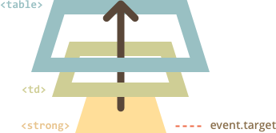

# 事件委托

<<<<<<< HEAD
捕获和冒泡允许实现一种称为**事件委托**的强大的事件处理模式。
=======
Capturing and bubbling allow us to implement one of most powerful event handling patterns called *event delegation*.
>>>>>>> 6bbe0b4313a7845303be835d632ef8e5bc7715cd

我们的想法是，如果我们有许多元素是以类似的方式处理的，那么我们就不需要给每个元素分配一个处理器 —— 而是在它们共同的祖先上面添加一个处理器。

在处理器中，我们可以得到 `event.target`，查看事件实际发生的位置并处理它。

我们看一个示例 —— 反映中国古代哲学的[八卦图](http://en.wikipedia.org/wiki/Ba_gua)。

就是这个：

[iframe height=350 src="bagua" edit link]

HTML 如下所示：

```html
<table>
  <tr>
    <th colspan="3"><em>Bagua</em> Chart: Direction, Element, Color, Meaning</th>
  </tr>
  <tr>
    <td>...<strong>Northwest</strong>...</td>
    <td>...</td>
    <td>...</td>
  </tr>
  <tr>...2 more lines of this kind...</tr>
  <tr>...2 more lines of this kind...</tr>
</table>
```

该表有 9 个单元格，但可能有 99 个或者 9999 个单元，这些都不重要。

**我们的任务是在单击时高亮显示一个 `<td>` 单元格。**

相比为每个 `<td>`（可能有很多）分配一个 `onclick` 处理器 —— 我们可以为 `<table>` 元素设置一个 "catch-all" 处理器。

它会使用 `event.target` 来获取单击的元素并高亮显示它。

代码：

```js
let selectedTd;

*!*
table.onclick = function(event) {
  let target = event.target; // 在哪里单击的？

  if (target.tagName != 'TD') return; // 不在 TD 上？那么我们就不会在意

  highlight(target); // 高亮显示
};
*/!*

function highlight(td) {
  if (selectedTd) { // 移除任何已存在的高亮显示内容
    selectedTd.classList.remove('highlight');
  }
  selectedTd = td;
  selectedTd.classList.add('highlight'); // 高亮新的 td
}
```

代码不会关心在表中有多少单元格。随时可以动态添加/移除 `<td>`，高亮显示仍然有效。

尽管如此，还是存在缺点。

单击可能不是发生在 `<td>` 上，而是发生在其内部。

在我们的例子中，如果我们查看 HTML 内部，我们可以看到 `<td>` 内的嵌套标签，比如 `<strong>`：

```html
<td>
*!*
  <strong>Northwest</strong>
*/!*
  ...
</td>
```

当然，如果单击该 `<strong>`，那么它将成为 `event.target` 的值。



在处理器 `table.onclick` 中，我们应该接受这样的 `event.target`，并确定单击是否在 `<td>` 内。

以下是改进后的代码：

```js
table.onclick = function(event) {
  let td = event.target.closest('td'); // (1)

  if (!td) return; // (2)

  if (!table.contains(td)) return; // (3)

  highlight(td); // (4)
};
```

解释：
1. `elem.closest(selector)` 方法返回与选择器匹配的最近的祖先。在我们的例子中，我们从源元素向上查找 `<td>`。
2. 如果 `event.target` 不在任何 `<td>` 中，那么调用将返回 `null`，我们不需要做任何事情。
3. 在嵌套表的情况下，`event.target` 可能是位于当前表格之外的 `<td>`。因此我们需要检查这是否是**我们的表格**的 `<td>`。
4. 如果是的话，就高亮显示它。

## 委托示例：标记中的操作

事件委托可优化事件处理。我们使用单个处理器来对许多元素进行相似的操作。就像我们用于高亮显示 `<td>` 一样。

但我们仍然可以使用单个处理器作为许多不同事件的入口点。

例如，我们想要制作一个有“保存”、“加载”和“搜索”等功能的菜单。有一个拥有 `save`、`load` 和 `search` 等方法的对象。

第一个想法可能是为每个按钮分配一个单独的处理器。但有一个更优雅的解决方案。我们可以为整个菜单添加一个处理器，并为有方法调用的按钮添加 `data-action` 属性：

```html
<button *!*data-action="save"*/!*>Click to Save</button>
```

处理器读取属性并执行方法。查看下述运行示例：

```html autorun height=60 run
<div id="menu">
  <button data-action="save">Save</button>
  <button data-action="load">Load</button>
  <button data-action="search">Search</button>
</div>

<script>
  class Menu {
    constructor(elem) {
      this._elem = elem;
      elem.onclick = this.onClick.bind(this); // (*)
    }

    save() {
      alert('saving');
    }

    load() {
      alert('loading');
    }

    search() {
      alert('searching');
    }

    onClick(event) {
*!*
      let action = event.target.dataset.action;
      if (action) {
        this[action]();
      }
*/!*
    };
  }

  new Menu(menu);
</script>
```

请注意，`this.onClick` 在 `(*)` 中绑定到了 `this`。这很重要，否则内部 `this` 将引用 DOM 元素（`elem`），而不是菜单对象，`this[action]` 不是我们所需要的。

那么，这里的委托给我们带来了什么？

```compare
+ 我们不需要编写代码来为每个按钮分配一个处理器。只需要创建一个方法并将其放入标记中即可。
+ HTML 结构灵活，可以随时添加/移除按钮。
```

我们也可以使用 `.action-save`、`.action-load`，但 `data-action` 属性在语义上更好。我们也可以在 CSS 规则中使用它。

## “行为型”模式

我们还可以使用事件委托**声明式**地通过特定属性和类为元素添加“行为”。

模式分为两步：
1. 我们向元素添加一个特殊属性。
2. 用文档范围级的处理器追踪事件，如果事件发生在具有特定属性的元素上 —— 则执行该操作。

### 计数

<<<<<<< HEAD
例如，这里的 `data-counter` 属性给按钮添加了一个“点击增加”的行为。
=======
For instance, here the attribute `data-counter` adds a behavior: "increase value on click" to buttons:
>>>>>>> 6bbe0b4313a7845303be835d632ef8e5bc7715cd

```html run autorun height=60
Counter: <input type="button" value="1" data-counter>
One more counter: <input type="button" value="2" data-counter>

<script>
  document.addEventListener('click', function(event) {

    if (event.target.dataset.counter != undefined) { // if the attribute exists...
      event.target.value++;
    }

  });
</script>
```

如果我们点击按钮 —— 它的值就会增加。但不仅仅是按钮，一般的方法在这里也很重要。

我们可以有很多像 `data-counter` 一样的属性。我们可以在任何时候向 HTML 添加新的属性。使用事件委托，我们可以“扩展” HTML，添加一个描述新行为的属性。

```warn header="对于文档级的处理器 —— 始终是 `addEventListener`"
当我们将事件处理器分配给 `document` 对象，我们应该始终使用 `addEventListener`，而不是 `document.onclick`，因为后者会导致冲突：新的处理器会重写旧的。

对于实际项目来说。代码的不同部分设置的 `document` 上有许多处理器是正常的。
```

### 切换器

再举一个例子，单击一个具有 `data-toggle-id` 属性的元素将显示/隐藏具有给定 `id` 的元素：

```html autorun run height=60
<button *!*data-toggle-id="subscribe-mail"*/!*>
  Show the subscription form
</button>

<form id="subscribe-mail" hidden>
  Your mail: <input type="email">
</form>

<script>
*!*
  document.addEventListener('click', function(event) {
    let id = event.target.dataset.toggleId;
    if (!id) return;

    let elem = document.getElementById(id);

    elem.hidden = !elem.hidden;
  });
*/!*
</script>
```

让我们再一次指出我们做了什么。现在，要将切换功能添加到元素中 —— 不需要了解 JavaScript，只需要使用 `data-toggle-id` 属性。

这可能变得非常方便 —— 不需要为每个这样的元素编写 JavaScript。只需要使用行为。文档级处理器使其可以用于页面的任何元素。

我们也可以结合单个元素上的多个行为。

“行为型”模式可以替代 JavaScript 的小片段。

## 总结

事件委托真的很酷！这是 DOM 事件最有用的模式之一。

它通常用于为许多相似的元素添加相同的处理，但不仅仅只是这样。

算法：

1. 在容器上设置一个处理器。
2. 在处理器中 —— 检查源元素的 `event.target`。
3. 如果事件发生在我们感兴趣的元素中，那么处理该事件。

好处：

```compare
+ 简化初始化并节省内存：不需要添加许多处理器。
+ 更少的代码：添加或移除元素时，不需要添加/移除处理器。
+ DOM 修改 ：我们可以使用 `innerHTML` 等来大量添加/移除元素。
```

委托处理方式也有局限性：

```compare
- 首先，事件必须冒泡。而有些事件不会冒泡。此外，低级别的处理器不应该使用 `event.stopPropagation()`。
- 其次，委托会增加 CPU 负载，因为容器等级的处理器对容器中任何位置的事件做出反应，不管它们是否会引起我们的兴趣。但是通常负载是可以忽略不计的，所以我们不考虑它。
```
