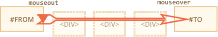

# 移动：mouseover/out，mouseenter/leave

我们将深入研究鼠标在元素之间移动时所发生事件的更多细节。

## Mouseover/mouseout，relatedTarget

当鼠标指针出现在一个元素上时，`mouseover` 事件就会发生，而 `mouseout` 事件则发生在鼠标指针离开时。


这些事件很特别，因为它们有 `relatedTarget`。

对于 `mouseover`：

- `event.target` —— 是鼠标经过的那个元素。
- `event.relatedTarget` —— 是来自鼠标的那个元素。

`mouseout` 则与之相反：

- `event.target` —— 是鼠标离开的元素。
- `event.relatedTarget` —— 是新指针下的元素（鼠标离开的）。

```online
在下面示例中，每个特性都是一个元素。当你移动鼠标时你可以看到文本区域的鼠标事件。

每个事件都有关于元素的来源以及来源的信息。

[codetabs src="mouseoverout" height=280]
```

```warn header="`relatedTarget` 可以为 `null`"
`relatedTarget` 属性可以为 `null`。

这很正常，而且意味着鼠标不是来源于另一个元素，而是窗口以外。或者是离开了窗口。

当我们在代码中使用 `event.relatedTarget` 时，我们应该记住这种可能性。如果我们访问 `event.relatedTarget.tagName`，那么就会出现错误。
```

## 事件频率

当有鼠标移动时，`mousemove` 事件就会被触发。但是这不意味着每个像素都会产生一个事件。

浏览器会一直检查鼠标的位置。如果它注意到鼠标变化了，那么就会触发相应的事件。

这意味着如果访问者非常快地移动鼠标，那么 DOM 元素就会被跳过：



如果鼠标从上面的 `#FROM` 到 `#TO` 元素移动地非常快，那么中间的 `<div>`（或其中的一些）可能会被跳过。`mouseout` 事件可能会在 `#FROM` 上被触发，然后在 `#TO` 上触发 `mouseover`。

这在实践中是有用的，因为可能会有许多中间元素。我们并不是真的想要处理每一个进入离开的过程。

另一方面，我们应该记住，我们不能假设鼠标会缓慢地从一个事件移动到另一个事件。是的，它只会“跳”。

特别是，光标可能从窗口外跳进页面的中间。而且是因为 `relatedTarget=null` 来自 "nowhere"：


<div style="display:none">
在快速移动的情况下，中间元素可能不会触发事件。但如果鼠标进入元素（`mouseover`），当它离开时，我们就会被保证获得 `mouseout`。
</div>

```online
在下面的 teststand 检查它是否“存在”。

HTML 是两个嵌套的 `<div>` 元素。如果你将鼠标快速通过它们，那么不会有事件发生，或者只有红色 div 的事件被触发，或者是绿色 div 的事件被触发。

同时尝试将指针移动到红色的 `div` 上，然后指针快速地向下并通过绿色的 `div`。如果移动足够快，那么父元素都会被忽略。

[codetabs height=360 src="mouseoverout-fast"]
```

## 离开子代时的“额外” mouseout

想象一下 —— 鼠标指针进入一个元素。`mouseover` 被触发。然后光标进入一个子元素。有趣的事实是 `mouseout` 在这种情况下被触发。光标仍然在元素中，但我们有一个来自它的 `mouseout`！


这听起来很奇怪，但很容易解释。

**根据浏览器逻辑，鼠标光标只在任意时间只会位于*单个*元素上 —— 嵌套最多的那个（按 z 索引计算）。**

因此如果它转到另一个元素（甚至是一个子代），那么他将离开先前的那个。就这么简单。

以下示例使我们可以看到的一个有趣结果。

红色的 `<div>` 嵌套在蓝色的 `<div>` 中。蓝色的 `<div>` 有 `mouseover/out` 处理器可以记录在文本区发生的所有事件。

尝试进人蓝色元素，然后鼠标移动到红色的上面 —— 然后观察事件：

[codetabs height=360 src="mouseoverout-child"]

1. 在进入蓝色层时 —— 我们获取到了 `mouseover [target: blue]`。
2. 之后从蓝色移动红色时 —— 我们获取到了 `mouseout [target: blue]`（离开父元素）。
3. ...然后立即获取到的是 `mouseover [target: red]`。

因此，对于不考虑 `target` 的处理器，这看起来就像是我们将父元素留在 `(2)` 的 `mouseout` 中然后在 `(3)` 中返回给 `mouseover`。

如果我们在进入/离开元素时执行一些动作，那么就会得到许多额外“错误”运行。对于简单的事情可能不引人注目。但对于复制事情来说，会带来不必要的副作用。

我们可以通过使用 `mouseenter/mouseleave` 事件来修复。

## Mouseenter 和 mouseleave 事件

`mouseenter/mouseleave` 事件类似于 `mouseover/mouseout`。当鼠标指针移入/移出元素时，它们也会被触发。

但有两个不同之处：

1. 元素内的转换不会被计算。
2. `mouseenter/mouseleave` 事件不会冒泡。

这些事件在直觉上非常清晰。

当指针进入一个元素时 —— `mouseenter` 被触发，而它在元素内部的去向并不重要。只有当鼠标光标离开时，`mouseleave` 事件才会被触发。

如果我们做了相同的例子，但将 `mouseenter/mouseleave` 放在蓝色 `<div>` 中，再做相同的操作 —— 我们就会看到只有移入或移出蓝色 `<div>` 时，事件才会被触发。当鼠标进入红色和黑色时，不会有任何反应。子代被全部忽略。

[codetabs height=340 src="mouseleave"]

## 事件委托

`mouseenter/leave` 事件非常简单，也非常容易使用。但它们不会冒泡。因此我们不能用它们来进行事件委托。

想象我们想要为表单元来处理鼠标的移入/移除。有几百个表单元。

通常的解决方案是 —— 在 `<table>` 中设置处理器，并在那里处理事件。但 `mouseenter/leave` 不会冒泡。因此如果类似事件发生在 `<td>` 上，那么只有 `<td>` 上的处理器才能捕获到它。

只有在移入/移出整个表单时才会触发处理器处理 `<table>` 上的 `mouseenter/leave`。它不会获取到关于内部过度的信息。 

没问题 —— 我们使用 `mouseover/mouseout`。

一个简单的处理器可能像这样：

```js
// 高亮鼠标下的单元
table.onmouseover = function(event) {
  let target = event.target;
  target.style.background = 'pink';
};

table.onmouseout = function(event) {
  let target = event.target;
  target.style.background = '';
};
```

```online
[codetabs height=480 src="mouseenter-mouseleave-delegation"]
```

进入到任何元素或者表格内的元素时，这些处理器都可以运行。

但我们只想作为一个整体来处理 `<td>` 中的转换。把单元作为整体来高亮显示。我们不想处理 `<td>` 子级之间发生的转换。

其中一个解决方案：

- 记住在变量中高亮显示的 `<td>`。
- `mouseover` ——  如果我们仍然在当前 `<td>` 内，则忽略该事件。
- `mouseout` —— 如果我们离开 `<td>`，则忽略。

当我们在 `<td>` 的子代间移动时，会过滤掉“额外”事件。

```offline
详细信息在[完整示例中](sandbox:mouseenter-mouseleave-delegation-2)。
```

```online
以下是包含完整示例的所有细节：

[codetabs height=380 src="mouseenter-mouseleave-delegation-2"]

尝试将光标移进单元和表哥中，太快或太慢都有问题。与之前不同的是只有 `<td>` 作为一个整体被高亮显示。
```


## 总结

我们涉及了 `mouseover`、`mouseout`、`mousemove`、`mouseenter` 和 `mouseleave` 事件。

值得注意的事情：

- 鼠标的快速移动可以使 `mouseover, mousemove, mouseout` 跳过一些中间元素。
- `mouseover/out` 事件和 `mouseenter/leave` 事件有一个额外的目标：`relatedTarget`。这是我们从/到的元素，是对 `target` 的补充。
- 即使当我们从父元素转到子元素时，`mouseover/out` 才被触发。它们假设鼠标一词只会移入一个元素 —— 最深的那个。 
- `mouseenter/leave` 事件不会冒泡，而且当鼠标进入子元素时也不会被触发。它们只跟踪鼠标是否在整个元素的内部和外部。
