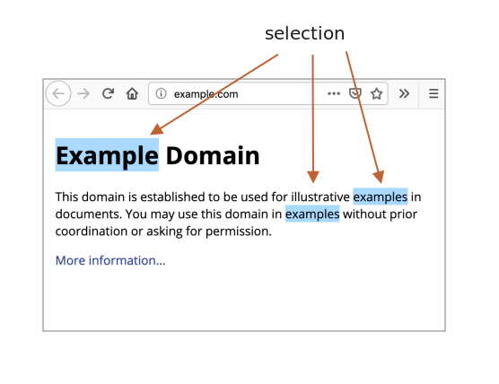

libs:
  - d3
  - domtree

---

# 选区（Selection）和范围（Range）

在本章中，我们将介绍文档中的选区以及表单字段（如 `<input>`）中的选区。

JavaScript 可以获取现有选区，全部或部分选择/取消选择，从文档中删除所选择的部分，将其包到一个标记（tag）中，等等。

最后，您可以在文末的"总结"部分中找到使用方法。但是，如果您阅读整章内容，将会获得更多。基本的 `Range` 和 `Selection` 对象很容易掌握，因此不需要任何诀窍便可实现你想要的操作。

## 范围

选区的基本概念是 [Range](https://dom.spec.whatwg.org/#ranges)：本质上是一对“边界点”：范围起点和范围终点。

每个点都表示为一个父 DOM 节点，从起点偏移一段距离。如果父节点是元素节点，则偏移量是子节点个数，对于文本节点而言，则是文本中的位置。下面举例来说。

让我们选择点什么。

首先，我们可以创建一个范围（构造函数不带参数）：

```js
let range = new Range();
```

然后，我们可以使用 `range.setStart(node, offset)` 和 `range.setEnd(node, offset)` 来设置选区边界。

例如，考虑以下 HTML 片段：

```html
<p id="p">Example: <i>italic</i> and <b>bold</b></p>
```

这是它的 DOM 结构，请注意，这里的文本节点对我们很重要：

<div class="select-p-domtree"></div>

<script>
let selectPDomtree = {
  "name": "P",
  "nodeType": 1,
  "children": [{
    "name": "#text",
    "nodeType": 3,
    "content": "Example: "
  }, {
    "name": "I",
    "nodeType": 1,
    "children": [{
      "name": "#text",
      "nodeType": 3,
      "content": "italic"
    }]
  }, {
    "name": "#text",
    "nodeType": 3,
    "content": " and "
  }, {
    "name": "B",
    "nodeType": 1,
    "children": [{
      "name": "#text",
      "nodeType": 3,
      "content": "bold"
    }]
  }]
}

drawHtmlTree(selectPDomtree, 'div.select-p-domtree', 690, 320);
</script>

我们来选择 `"Example: <i>italic</i>"`。那是 `<p>` 的头两个子节点（文本节点包括在内）：


```html run
<p id="p">Example: <i>italic</i> and <b>bold</b></p>

<script>
*!*
  let range = new Range();

  range.setStart(p, 0);
  range.setEnd(p, 2);
*/!*

  // 范围的 toString 以文本形式返回其内容（不带标签）
  alert(range); // Example: italic

  // 将此范围应用于文档选区（稍后解释）
  document.getSelection().addRange(range);
</script>
```

- `range.setStart(p, 0)` － 将起始位置设为 `<p>` 的第 0 个子节点（即文本节点 `"Example: "`）。
- `range.setEnd(p, 2)` － 覆盖范围至（但不包括）`<p>` 的第 2 个子节点（即文本节点 `" and "`，但由于不包括末节点，最后选择的节点是 `<i>`）。

下面的测试更加灵活，您可以在其中尝试更多不同的情况：

```html run autorun
<p id="p">Example: <i>italic</i> and <b>bold</b></p>

From <input id="start" type="number" value=1> – To <input id="end" type="number" value=4>
<button id="button">Click to select</button>
<script>
  button.onclick = () => {
  *!*
    let range = new Range();

    range.setStart(p, start.value);
    range.setEnd(p, end.value);
  */!*

    // 应用选区，后文有解释
    document.getSelection().removeAllRanges();
    document.getSelection().addRange(range);
  };
</script>
```

例如，从 `1` 到 `4` 选择得到的范围为 `<i>italic</i> and <b>bold</b>`。


我们不必在 `setStart` 和 `setEnd` 中使用相同的节点。一个范围可能跨越许多不相关的节点。唯一要注意的是终点要在起点之后。

### 选择文本节点的一部分

让我们部分地选择文本，如下所示：


这也是可以做到的，我们只需要将起点和终点设置为文本节点中的相对偏移量即可。

我们需要创建一个范围，即：
- 从 `<p>` 的第一个子节点的位置 2 开始（选择 "Ex<b>ample:</b> " 中除头两个字符外的所有字符)
- 到 `<b>` 的第一个子节点的位置 3 结束（选择 "<b>bol</b>d" 的头三个字符，就这些）：

```html run
<p id="p">Example: <i>italic</i> and <b>bold</b></p>

<script>
  let range = new Range();

  range.setStart(p.firstChild, 2);
  range.setEnd(p.querySelector('b').firstChild, 3);

  alert(range); // ample: italic and bol

  // 在选区中使用此范围（后文有解释）
  window.getSelection().addRange(range);
</script>
```

范围对象具有以下属性：


- `startContainer`、`startOffset` － 起始节点和偏移量，
  - 在上例中：分别是 `<p>` 中的第一个文本节点和 `2`。
- `endContainer`、`endOffset` － 结束节点和偏移量，
  - 在上例中：分别是 `<b>` 中的第一个文本节点和 `3`。
- `collapsed` － 布尔值，如果范围在同一点上开始和结束（因此范围内没有内容）则为 `true` ，
  - 在上例中：`false`
- `commonAncestorContainer` － 在范围内的所有节点中最近的祖先节点，
  - 在上例中：`<p> `

## Range 方法

有许多方便的方法可以操作范围。

设置范围的起始：

- `setStart(node, offset)` 设置起始于：`node` 中的位置 `offset`
- `setStartBefore(node)` 设置起始于：`node` 之前
- `setStartAfter(node)` 设置起始于：`node` 之后

设置范围的结束（类似方法）：

- `setEnd(node, offset)` 设置结束于：`node` 中的位置 `offset`
- `setEndBefore(node)` 设置结束于：`node` 之前
- `setEndAfter(node)` 设置结束于：`node` 之后

**如前所述，`node` 既可以是文本节点，也可以是元素节点：对于文本节点，`offset` 偏移的是字符数，而对于元素节点则是节点数。**

其他：
- `selectNode(node)` 设置范围以选择整个 `node`
- `selectNodeContents(node)` 设置范围以选择整个 `node` 的内容
- `collapse(toStart)` 如果 `toStart=true` 则设置 end=start，否则设置 start=end，从而折叠范围
- `cloneRange()` 创建一个具有相同起始/结束的新范围

如要操作范围内的内容：

- `deleteContents()` － 从文档中删除范围内容
- `extractContents()` － 从文档中删除范围内容，并返回 [DocumentFragment](info:modifying-document#document-fragment)
- `cloneContents()` － 复制范围内容，并返回 [DocumentFragment](info:modifying-document#document-fragment)
- `insertNode(node)` － 在范围的起始处向文档中插入 `node`
- `surroundContents(node)` － 以 `node` 包裹所选范围内容。要达到上述效果，则该范围内的所有元素都必须包含开始和结束标记：不能像 `<i>abc` 这样的部分范围。

使用这些方法，我们基本上可以对选定的节点执行任何操作。

以下测试显示它们的实际效果：

```html run autorun height=260
单击按钮来运行所选内容上的方法，单击 "resetExample" 重置。

<p id="p">Example: <i>italic</i> and <b>bold</b></p>

<p id="result"></p>
<script>
  let range = new Range();

  // 下面演示上述的各个方法：
  let methods = {
    deleteContents() {
      range.deleteContents()
    },
    extractContents() {
      let content = range.extractContents();
      result.innerHTML = "";
      result.append("extracted: ", content);
    },
    cloneContents() {
      let content = range.cloneContents();
      result.innerHTML = "";
      result.append("cloned: ", content);
    },
    insertNode() {
      let newNode = document.createElement('u');
      newNode.innerHTML = "NEW NODE";
      range.insertNode(newNode);
    },
    surroundContents() {
      let newNode = document.createElement('u');
      try {
        range.surroundContents(newNode);
      } catch(e) { alert(e) }
    },
    resetExample() {
      p.innerHTML = `Example: <i>italic</i> and <b>bold</b>`;
      result.innerHTML = "";

      range.setStart(p.firstChild, 2);
      range.setEnd(p.querySelector('b').firstChild, 3);

      window.getSelection().removeAllRanges();  
      window.getSelection().addRange(range);  
    }
  };

  for(let method in methods) {
    document.write(`<div><button onclick="methods.${method}()">${method}</button></div>`);
  }

  methods.resetExample();
</script>
```

还有比较范围的方法，但是很少使用。如您需要，请参考 [规范](https://dom.spec.whatwg.org/#interface-range) 或 [MDN 手册](https://developer.mozilla.org/en-US/docs/Web/API/Range)。


## 选区

`Range` 是用于管理选区范围的通用对象。我们可能会创建此类对象，传递范围 － 它们在视觉上不会自行选择任何内容。

文档的选区是由 `Selection` 对象表示的，可通过 `window.getSelection()` 或 `document.getSelection()` 来获取。

一个选区可以包括零个或多个范围。至少， [选区 API 规范](https://www.w3.org/TR/selection-api/) 是这么说的。不过实际上，只有 Firefox 允许使用 `key:Ctrl+click` (Mac 上用 `key:Cmd+click`) 在文档中选择多个范围。

这是在 Firefox 中做的一个具有 3 个范围的选区截图：



其他浏览器最多支持 1 个范围。正如我们将看到的，某些 `Selection` 方法暗示可能有多个范围，但同样，在除 Firefox 之外的所有浏览器中，范围最多是 1。

## 选区属性

与范围相似，选区的起点称为“锚点（anchor）”，终点称为“焦点（Focus）”。

主要的选区属性是：

- `anchorNode` － 选区的起始节点,
- `anchorOffset` － 选区开始处 `anchorNode` 的偏移量，
- `focusNode` － 选区的结束节点，
- `focusOffset` － 选区开始处 `focusNode` 的偏移量，
- `isCollapsed` － 如果未选择任何内容（空范围）或不存在，则为 `true` 。
- `rangeCount` － 选区中的范围数，除 Firefox 外，其他浏览器最多为 `1`。

````smart header="在文档中，选区的终点可能在起点之前"
有很多选择内容的方法，视用户操作而定：鼠标、热键、手机上点击等。

其中的某些方法，例如鼠标，可以在两个方向上创建相同的选区：“从左至右”和“从右至左”。

如果在文档中选区的起点（锚点）在终点（焦点）之前，则称此选区具有“向前（forward）”方向。

例如，如果用户开始使用鼠标从 "Example" 选择到 "italic"：


否则，如果是从 "italic" 的末尾选择到 "Example"，则该选区方向是“向后（backward）”，其焦点是在锚点之前：


这与始终向前的 `Range` 对象不同：范围的起点不能在终点之后。
````

## 选区事件

有一些事件可以跟踪选区：

- `elem.onselectstart` － 当在 `elem` 上开始选择时，例如，用户按下鼠标键并开始移动鼠标。
    - 阻止默认操作会使选择无法开始。
- `document.onselectionchange` － 当选区变动时
    -请注意：此处理程序只能在 `document` 上设置。

### 选区跟踪示例代码

下面是一小段代码，演示如何随选区的改变来动态显示其边界：

```html run height=80
<p id="p">Select me: <i>italic</i> and <b>bold</b></p>

From <input id="from" disabled> – To <input id="to" disabled>
<script>
  document.onselectionchange = function() {
    let {anchorNode, anchorOffset, focusNode, focusOffset} = document.getSelection();

    from.value = `${anchorNode && anchorNode.data}:${anchorOffset}`;
    to.value = `${focusNode && focusNode.data}:${focusOffset}`;
  };
</script>
```

### 选区获取示例代码

如要获取整个选区：
- 作为文本：只需调用 `document.getSelection().toString()`。
- 作为 DOM 节点：获取底层的范围并调用其 `cloneContents()` 方法（如果我们不支持 Firefox 多选区的话，则仅取第一个范围）。 

下面是将选区选作为文本和 DOM 节点的示例代码：

```html run height=100
<p id="p">Select me: <i>italic</i> and <b>bold</b></p>

Cloned: <span id="cloned"></span>
<br>
As text: <span id="astext"></span>

<script>
  document.onselectionchange = function() {
    let selection = document.getSelection();

    cloned.innerHTML = astext.innerHTML = "";

    // 从范围复制 DOM 节点（这里我们支持多选）
    for (let i = 0; i < selection.rangeCount; i++) {
      cloned.append(selection.getRangeAt(i).cloneContents());
    }

    // 以文本形式获取
    astext.innerHTML += selection;
  };
</script>
```

## 选区方法

添加/删除范围的选区方法：

- `getRangeAt(i)` － 获取从 `0` 开始的第 i 个范围。在除 Firefox 之外的所有浏览器中，仅使用 `0`。
- `addRange(range)` － 将 `range` 添加到选区中。如果选区已有关联的范围，则除 Firefox 外的所有浏览器都将忽略该调用。
- `removeRange(range)` － 从选区中删除 `range`。
- `removeAllRanges()` － 删除所有范围。
- `empty()` － `removeAllRanges` 的别名。

另外，还有一些方便的方法可以直接操作选区范围，而无需使用 `Range`：

- `collapse(node, offset)` － 用一个新的范围替换选定的范围，该新范围从给定的 `node` 处开始，到偏移 `offset` 处结束。
- `setPosition(node, offset)` － `collapse` 的别名。
- `collapseToStart()` － 折叠（以空范围替换）到选区起点，
- `collapseToEnd()` － 折叠到选区终点，
- `extend(node, offset)` － 将选区的焦点移到给定的 `node`，位置偏移 `oofset`，
- `setBaseAndExtent(anchorNode, anchorOffset, focusNode, focusOffset)` － 用给定的起点 `anchorNode/anchorOffset` 和 终点 `focusNode/focusOffset` 来替换选区范围。选中它们之间的所有内容。
- `selectAllChildren(node)` － 选择 `node` 的所有子节点。
- `deleteFromDocument()` － 从文档中删除所选内容。
- `containsNode(node, allowPartialContainment = false)` － 检查选区中是否包含 `node`（特别是如果第二个参数是 `true` 的话）

因此，对于许多任务，我们可以调用 `Selection` 方法，而无需访问底层的 `Range` 对象。

例如，选择段落 `<p>` 的全部内容：

```html run
<p id="p">Select me: <i>italic</i> and <b>bold</b></p>

<script>
  // 从 <p> 的第 0 个子节点中选择到最后一个子节点
  document.getSelection().setBaseAndExtent(p, 0, p, p.childNodes.length);
</script>
```

同样用范围来做：

```html run
<p id="p">Select me: <i>italic</i> and <b>bold</b></p>

<script>
  let range = new Range();
  range.selectNodeContents(p); // 或用 selectNode(p) 也选择 <p> 标记

  document.getSelection().removeAllRanges(); // 清除现有选区（如果有的话）
  document.getSelection().addRange(range);
</script>
```

```smart header="如要选择，先删除现有的选区"
如果选区已存在，则先用 `removeAllRanges()` 删除之。然后添加范围。否则，除 Firefox 外的所有浏览器都将忽略新范围。

某些选区方法是一个例外，它们会替换现有的选区，例如 `setBaseAndExtent`。
```

## 表单控件中的选区

表单元素如 `input` 和 `textarea` 提供 [选区专用 API](https://html.spec.whatwg.org/#textFieldSelection)，没有 `Selection` 或 `Range` 对象。由于输入值是纯文本而不是 HTML，因此不需要此类对象，一切都变得更加简单。

属性：
- `input.selectionStart` － 选区的起始位置（可写），
- `input.selectionEnd` － 选区的结束位置（可写），
- `input.selectionDirection` － 选区方向，可以是："forward", "backward" 或 "none"（如通过双击选区），

事件：
- `input.onselect` － 选择某项时触发。

方法：

- `input.select()` － 选择文本控件中的所有内容（可以是 `textarea` 而不是 `input`），
- `input.setSelectionRange(start, end, [direction])` － 在给定方向上（可选），从 `start` 一直选择到 `end`。
- `input.setRangeText(replacement, [start], [end], [selectionMode])` － 用新文本替换文本范围。

    可选参数 `start` 和 `end`，如果提供的话，则设置范围的起点和终点，否则使用用户选区。

    最后一个参数 `selectionMode` 决定替换文本后如何设置选区。可能的值为：

    - `"select"` － 将选择新插入的文本。
    - `"start"` － 选区范围在插入的文本之前折叠（光标将在其之前）。
    - `"end"` － 选区范围在插入的文本之后折叠（光标将在其后）。
    - `"preserve"` － 尝试保留选区。这是默认值。

现在，让我们看看这些方法的实际使用。

### 示例：跟踪选区

例如，此段代码使用 `onselect` 事件来跟踪选区：

```html run autorun
<textarea id="area" style="width:80%;height:60px">
Selecting in this text updates values below.
</textarea>
<br>
From <input id="from" disabled> – To <input id="to" disabled>

<script>
  area.onselect = function() {
    from.value = area.selectionStart;
    to.value = area.selectionEnd;
  };
</script>
```

请注意：
- `onselect` 是在选定某项时触发，而不是在删除选定项时触发。
- 根据 [规范手册](https://w3c.github.io/selection-api/#dfn-selectionchange)，`document.onselectionchange` 事件不应触发表单控件内的选区，因为它与 `document` 选区和范围不相关。一些浏览器会生成它，但我们不应该依赖它。


### 示例：移动光标

我们可以更改 `selectionStart` 和 `selectionEnd`，二者设定了选区。

一个重要的边界情况是 `selectionStart` 和 `selectionEnd` 彼此相等。那就正是光标位置。或者，换句话说，当未选择任何内容时，选区会在光标位置折叠。

因此，通过设置 `selectionStart` 和 `selectionEnd` 为相同的值，我们可以移动光标。

例如：

```html run autorun
<textarea id="area" style="width:80%;height:60px">
Focus on me, the cursor will be at position 10.
</textarea>

<script>
  area.onfocus = () => {
    // 将 setTimeout 设为零延迟，以便在浏览器“焦点”操作完成后运行
    setTimeout(() => {
      // 我们可以设置任何选区
      // 如果 start=end，则将光标精确定位在该位置
      area.selectionStart = area.selectionEnd = 10;
    });
  };
</script>
```

### 示例：修改选区

如要修改选区的内容，我们可以使用 `input.setRangeText()` 方法。当然，我们可以读取 `selectionStart/End`，并在了解选区的情况下更改 `value` 的相应子字符串，但是 `setRangeText` 功能更强大，通常更方便。

那是一个有点复杂的方法。使用其最简单的单参数形式，它可以替换用户选择的范围并删除该选区。

例如，在这里，用户选区将由 `*...*` 包裹：

```html run autorun
<input id="input" style="width:200px" value="Select here and click the button">
<button id="button">Wrap selection in stars *...*</button>

<script>
button.onclick = () => {
  if (input.selectionStart == input.selectionEnd) {
    return; // 什么都没选
  }

  let selected = input.value.slice(input.selectionStart, input.selectionEnd);
  input.setRangeText(`*${selected}*`);
};
</script>
```

利用更多参数，我们可以设置范围 `start` 和 `end`。

在本示例中，我们在输入文本中找到 `"THIS"`，替换它并保持被选中的状态：

```html run autorun
<input id="input" style="width:200px" value="Replace THIS in text">
<button id="button">Replace THIS</button>

<script>
button.onclick = () => {
  let pos = input.value.indexOf("THIS");
  if (pos >= 0) {
    input.setRangeText("*THIS*", pos, pos + 4, "select");
    input.focus(); // 选中它，使选区可见
  }
};
</script>
```

### 示例：在光标处插入

如果未选择任何内容，或者在 `setRangeText` 中使用相同的 `start` 和 `end`，则仅插入新文本，不会删除任何内容。

我们也可以使用 `setRangeText` 在“光标处”插入一些东西。

这是一个按钮，按下后会在光标位置插入 `"HELLO"`，然后光标紧随其后。如果选区不为空，则将其替换（我们可以通过比较`selectionStart!=selectionEnd` 来进行检测，否则如为空则做点别的事）：

```html run autorun
<input id="input" style="width:200px" value="Text Text Text Text Text">
<button id="button">Insert "HELLO" at cursor</button>

<script>
  button.onclick = () => {
    input.setRangeText("HELLO", input.selectionStart, input.selectionEnd, "end");
    input.focus();
  };    
</script>
```


## 使不可选

要使某些内容不可选，有三种方式：

1. 使用 CSS 属性 `user-select: none`。

    ```html run
    <style>
    #elem {
      user-select: none;
    }
    </style>
    <div>Selectable <div id="elem">Unselectable</div> Selectable</div>
    ```

    这样不允许选区从 `elem` 开始。但是用户可以在其他地方开始选择，并将 `elem`包含在内。

    然后 `elem` 便成为 `document.getSelection()` 的一部分，因此选区是有了，但其内容通常在复制粘贴中被忽略。


2. 防止在 `onselectstart` 或 `mousedown` 事件中执行默认操作。

    ```html run
    <div>Selectable <div id="elem">Unselectable</div> Selectable</div>

    <script>
      elem.onselectstart = () => false;
    </script>
    ```

    这样可以防止在 `elem` 上开始选择，但是访问者可以在另一个元素上开始选择，然后扩展到 `elem`。

    当同一操作上有另一个事件处理程序该触发选区时（例如 `mousedown`），这便会很方便。因此我们禁用选区以避免冲突，仍然允许复制 `elem` 内容。

3. 我们也可以使用 `document.getSelection().empty()` 来清除选区。这很少使用，因为会在选区选中和消失时导致不必要的闪烁。

## 参考

- [DOM 规范: 范围（Range）](https://dom.spec.whatwg.org/#ranges)
- [选区（Selection）API](https://www.w3.org/TR/selection-api/#dom-globaleventhandlers-onselectstart)
- [HTML 规范: 用于文本控件选中的 APIs](https://html.spec.whatwg.org/multipage/form-control-infrastructure.html#textFieldSelection)


## 总结

我们介绍了选区的两种不同的 API：

1. 对于文档：`Selection` 和 `Range` 对象。
2. 对于 `input`、`textarea`：其他方法和属性。

第二个 API 非常简单，因为它处理的是文本。

最常用的方法可能是：

1. 获取选区：
    ```js run
    let selection = document.getSelection();

    let cloned = /* 要将选中的节点复制到其内的元素 */;

    // 然后将 Range 方法用于 selection.getRangeAt(0)
    // 或如此处一样，用于所有范围，以支持多选
    for (let i = 0; i < selection.rangeCount; i++) {
      cloned.append(selection.getRangeAt(i).cloneContents());
    }
    ```
2. 设置选区
    ```js run
    let selection = document.getSelection();

    // 直接：
    selection.setBaseAndExtent(...from...to...);

    // 或我们可以创建范围并：
    selection.removeAllRanges();
    selection.addRange(range);
    ```

最后，关于光标。在可编辑元素如 `<textarea>` 中，光标位置始终位于选区的起点或重点。我们可以通过设置 `elem.selectionStart` 和 `elem.selectionEnd` 来获取光标位置或移动光标。
