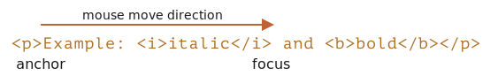
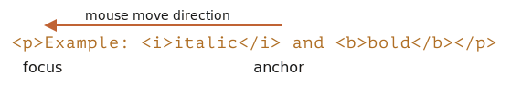

libs:
  - d3
  - domtree

---

# 选择（Selection）和范围（Range）

在本章中，我们将介绍文档中的选择以及在表单字段（如 `<input>`）中的选择。

JavaScript 可以获取现有选择，选择/取消全部或部分选择，从文档中删除所选部分，将其包装到一个标签（tag）中，等。

你可以在本文最后的“总结”部分中找到使用方法。但是，如果你阅读整篇内容，将会有更多收获。底层的（underlying）`Range` 和 `Selection` 对象很容易掌握，因此，你不需要任何诀窍便可以使用它们做你想要做的事儿。

## 范围

选择的基本概念是 [Range](https://dom.spec.whatwg.org/#ranges)：本质上是一对“边界点”：范围起点和范围终点。

每个点都被表示为一个带有相对于起点的相对偏移（offset）的父 DOM 节点。如果父节点是元素节点，则偏移量是子节点的编号，对于文本节点，则是文本中的位置。下面举例说明。

让我们选择一些东西。

首先，我们可以创建一个范围（构造器没有参数）：

```js
let range = new Range();
```

然后，我们可以使用 `range.setStart(node, offset)` 和 `range.setEnd(node, offset)` 来设置选择边界。

例如，考虑以下 HTML 片段：

```html
<p id="p">Example: <i>italic</i> and <b>bold</b></p>
```

这是其 DOM 结构，请注意，这里的文本节点对我们很重要：

<div class="select-p-domtree"></div>

<script>
let selectPDomtree = {
  "name": "P",
  "nodeType": 1,
  "children": [{
    "name": "#text",
    "nodeType": 3,
    "content": "Example: "
  }, {
    "name": "I",
    "nodeType": 1,
    "children": [{
      "name": "#text",
      "nodeType": 3,
      "content": "italic"
    }]
  }, {
    "name": "#text",
    "nodeType": 3,
    "content": " and "
  }, {
    "name": "B",
    "nodeType": 1,
    "children": [{
      "name": "#text",
      "nodeType": 3,
      "content": "bold"
    }]
  }]
}

drawHtmlTree(selectPDomtree, 'div.select-p-domtree', 690, 320);
</script>

让我们来选择 `"Example: <i>italic</i>"`。它是 `<p>` 的前两个子节点（文本节点也算在内）：


```html run
<p id="p">Example: <i>italic</i> and <b>bold</b></p>

<script>
*!*
  let range = new Range();

  range.setStart(p, 0);
  range.setEnd(p, 2);
*/!*

  // 范围的 toString 以文本形式返回其内容（不带标签）
  alert(range); // Example: italic

  // 将此范围应用于文档选择（后文有解释）
  document.getSelection().addRange(range);
</script>
```

- `range.setStart(p, 0)` —— 将起点设置为 `<p>` 的第 0 个子节点（即文本节点 `"Example: "`）。
- `range.setEnd(p, 2)` —— 覆盖范围至（但不包括）`<p>` 的第 2 个子节点（即文本节点 `" and "`，但由于不包括末节点，所以最后选择的节点是 `<i>`）。

这是一个更灵活的测试台，你可以在其中尝试更多不同的情况：

```html run autorun
<p id="p">Example: <i>italic</i> and <b>bold</b></p>

From <input id="start" type="number" value=1> – To <input id="end" type="number" value=4>
<button id="button">Click to select</button>
<script>
  button.onclick = () => {
  *!*
    let range = new Range();

    range.setStart(p, start.value);
    range.setEnd(p, end.value);
  */!*

    // 应用选择，后文有解释
    document.getSelection().removeAllRanges();
    document.getSelection().addRange(range);
  };
</script>
```

例如，从 `1` 到 `4` 选择得到的范围为 `<i>italic</i> and <b>bold</b>`。


我们不必在 `setStart` 和 `setEnd` 中使用相同的节点。一个范围可能跨越许多不相关的节点。唯一要注意的是终点要在起点之后。

### 选择文本节点的一部分

让我们选择部分文本，像这样：


这也是可以做到的，我们只需要将起点和终点设置为文本节点中的相对偏移量即可。

我们需要创建一个范围，它：
- 从 `<p>` 的第一个子节点的位置 2 开始（选择 "Ex<b>ample:</b> " 中除前两个字母外的所有字母）
- 到 `<b>` 的第一个子节点的位置 3 结束（选择 "<b>bol</b>d" 的前三个字母，就这些）：

```html run
<p id="p">Example: <i>italic</i> and <b>bold</b></p>

<script>
  let range = new Range();

  range.setStart(p.firstChild, 2);
  range.setEnd(p.querySelector('b').firstChild, 3);

  alert(range); // ample: italic and bol

  // 使用此范围进行选择（后文有解释）
  window.getSelection().addRange(range);
</script>
```

`range` 对象具有以下属性：


- `startContainer`，`startOffset` —— 起始节点和偏移量，
  - 在上例中：分别是 `<p>` 中的第一个文本节点和 `2`。
- `endContainer`，`endOffset` —— 结束节点和偏移量，
  - 在上例中：分别是 `<b>` 中的第一个文本节点和 `3`。
- `collapsed` —— 布尔值，如果范围在同一点上开始和结束（所以范围内没有内容）则为 `true`，
  - 在上例中：`false`
- `commonAncestorContainer` —— 在范围内的所有节点中最近的共同祖先节点，
  - 在上例中：`<p> `

## Range 方法

有许多便利的方法可以操纵范围。

设置范围的起点：

- `setStart(node, offset)` 将起点设置在：`node` 中的位置 `offset`
- `setStartBefore(node)` 将起点设置在：`node` 前面
- `setStartAfter(node)` 将起点设置在：`node` 后面

设置范围的终点（类似的方法）：

- `setEnd(node, offset)` 将终点设置为：`node` 中的位置 `offset`
- `setEndBefore(node)` 将终点设置为：`node` 前面
- `setEndAfter(node)` 将终点设置为：`node` 后面

**如前所述，`node` 既可以是文本节点，也可以是元素节点：对于文本节点，`offset` 偏移的是字符数，而对于元素节点则是子节点数。**

其他：
- `selectNode(node)` 设置范围以选择整个 `node`
- `selectNodeContents(node)` 设置范围以选择整个 `node` 的内容
- `collapse(toStart)` 如果 `toStart=true` 则设置 end=start，否则设置 start=end，从而折叠范围
- `cloneRange()` 创建一个具有相同起点/终点的新范围

如要操纵范围内的内容：

- `deleteContents()` —— 从文档中删除范围内容
- `extractContents()` —— 从文档中删除范围内容，并将删除的内容作为 [DocumentFragment](info:modifying-document#document-fragment) 返回
- `cloneContents()` —— 复制范围内容，并将复制的内容作为 [DocumentFragment](info:modifying-document#document-fragment) 返回
- `insertNode(node)` —— 在范围的起始处将 `node` 插入文档
- `surroundContents(node)` —— 使用 `node` 将所选范围内容包裹起来。要使此操作有效，则该范围必须包含其中所有元素的开始和结束标签：不能像 `<i>abc` 这样的部分范围。

使用这些方法，我们基本上可以对选定的节点执行任何操作。

这是在测试台上看到它们的实际效果：

```html run autorun height=260
点击按钮运行所选内容上的方法，点击 "resetExample" 进行重置。

<p id="p">Example: <i>italic</i> and <b>bold</b></p>

<p id="result"></p>
<script>
  let range = new Range();

  // 下面演示了上述的每个方法：
  let methods = {
    deleteContents() {
      range.deleteContents()
    },
    extractContents() {
      let content = range.extractContents();
      result.innerHTML = "";
      result.append("extracted: ", content);
    },
    cloneContents() {
      let content = range.cloneContents();
      result.innerHTML = "";
      result.append("cloned: ", content);
    },
    insertNode() {
      let newNode = document.createElement('u');
      newNode.innerHTML = "NEW NODE";
      range.insertNode(newNode);
    },
    surroundContents() {
      let newNode = document.createElement('u');
      try {
        range.surroundContents(newNode);
      } catch(e) { alert(e) }
    },
    resetExample() {
      p.innerHTML = `Example: <i>italic</i> and <b>bold</b>`;
      result.innerHTML = "";

      range.setStart(p.firstChild, 2);
      range.setEnd(p.querySelector('b').firstChild, 3);

      window.getSelection().removeAllRanges();  
      window.getSelection().addRange(range);  
    }
  };

  for(let method in methods) {
    document.write(`<div><button onclick="methods.${method}()">${method}</button></div>`);
  }

  methods.resetExample();
</script>
```

还有比较范围的方法，但是很少使用。当你需要它们时，请参考 [规范](https://dom.spec.whatwg.org/#interface-range) 或 [MDN 手册](mdn:/api/Range)。


## 选择

`Range` 是用于管理选择范围的通用对象。我们可能会创建此类对象，并传递它们 —— 它们在视觉上不会自行选择任何内容。

文档选择是由 `Selection` 对象表示的，可通过 `window.getSelection()` 或 `document.getSelection()` 来获取。

一个选择可以包括零个或多个范围。至少，[Selection API 规范](https://www.w3.org/TR/selection-api/) 是这么说的。不过实际上，只有 Firefox 允许使用 `key:Ctrl+click` (Mac 上用 `key:Cmd+click`) 在文档中选择多个范围。

这是在 Firefox 中做的一个具有 3 个范围的选择的截图：


其他浏览器最多支持 1 个范围。正如我们将看到的，某些 `Selection` 方法暗示可能有多个范围，但同样，在除 Firefox 之外的所有浏览器中，范围最多是 1。

## 选择属性

与范围相似，选择的起点称为“锚点（anchor）”，终点称为“焦点（focus）”。

主要的选择属性有：

- `anchorNode` —— 选择的起始节点，
- `anchorOffset` —— 选择开始的 `anchorNode` 中的偏移量，
- `focusNode` —— 选择的结束节点，
- `focusOffset` —— 选择开始处 `focusNode` 的偏移量，
- `isCollapsed` —— 如果未选择任何内容（空范围）或不存在，则为 `true` 。
- `rangeCount` —— 选择中的范围数，除 Firefox 外，其他浏览器最多为 `1`。

````smart header="在文档中，选择的终点可能在起点之前"
有很多选择内容的方式，取决于用户的操作：鼠标，热键，手机上的点击等。

其中的某些方式，例如鼠标，允许从两个方向创建相同的选择：“从左到右”和“从右到左”。

如果在文档中，选择的起点（anchor）在终点（focus）之前，则称此选择具有 "forward" 方向。

例如，如果用户使用鼠标从 "Example" 开始选择到 "italic"：



否则，如果是从 "italic" 的末尾开始选择到 "Example"，则所选内容将被定向为 "backward"，其焦点（focus）将在锚点（anchor）之前：



这与始终指向前方的 `Range` 对象不同：范围的起点不能在终点之后。
````

## 选择事件

有一些事件可以跟踪选择：

- `elem.onselectstart` —— 当选择从 `elem` 上开始时，例如，用户按下鼠标键并开始移动鼠标。
    - 阻止默认行为会使选择无法开始。
- `document.onselectionchange` —— 当选择变动时。
    - 请注意：此处理程序只能在 `document` 上设置。

### 选择跟踪演示

下面是一个小型演示，它随更改动态显示选择边界：

```html run height=80
<p id="p">Select me: <i>italic</i> and <b>bold</b></p>

From <input id="from" disabled> – To <input id="to" disabled>
<script>
  document.onselectionchange = function() {
    let {anchorNode, anchorOffset, focusNode, focusOffset} = document.getSelection();

    from.value = `${anchorNode && anchorNode.data}:${anchorOffset}`;
    to.value = `${focusNode && focusNode.data}:${focusOffset}`;
  };
</script>
```

### 选择获取演示

要获取整个选择：
- 作为文本：只需调用 `document.getSelection().toString()`。
- 作为 DOM 节点：获取底层的（underlying）范围，并调用它们的 `cloneContents()` 方法（如果我们不支持 Firefox 多选的话，则仅取第一个范围）。 

下面是将选择内容获取为文本和 DOM 节点的演示：

```html run height=100
<p id="p">Select me: <i>italic</i> and <b>bold</b></p>

Cloned: <span id="cloned"></span>
<br>
As text: <span id="astext"></span>

<script>
  document.onselectionchange = function() {
    let selection = document.getSelection();

    cloned.innerHTML = astext.innerHTML = "";

    // 从范围复制 DOM 节点（这里我们支持多选）
    for (let i = 0; i < selection.rangeCount; i++) {
      cloned.append(selection.getRangeAt(i).cloneContents());
    }

    // 获取为文本形式
    astext.innerHTML += selection;
  };
</script>
```

## 选择方法

添加/移除范围的选择方法：

- `getRangeAt(i)` —— 获取从 `0` 开始的第 i 个范围。在除 Firefox 之外的所有浏览器中，仅使用 `0`。
- `addRange(range)` —— 将 `range` 添加到选择中。如果选择已有关联的范围，则除 Firefox 外的所有浏览器都将忽略该调用。
- `removeRange(range)` —— 从选择中删除 `range`。
- `removeAllRanges()` —— 删除所有范围。
- `empty()` —— `removeAllRanges` 的别名。

另外，还有一些方便的方法可以直接操作选择范围，而无需使用 `Range`：

- `collapse(node, offset)` —— 用一个新的范围替换选定的范围，该新范围从给定的 `node` 处开始，到偏移 `offset` 处结束。
- `setPosition(node, offset)` —— `collapse` 的别名。
- `collapseToStart()` —— 折叠（替换为空范围）到选择起点，
- `collapseToEnd()` —— 折叠到选择终点，
- `extend(node, offset)` —— 将选择的焦点（focus）移到给定的 `node`，位置偏移 `oofset`，
- `setBaseAndExtent(anchorNode, anchorOffset, focusNode, focusOffset)` —— 用给定的起点 `anchorNode/anchorOffset` 和终点 `focusNode/focusOffset` 来替换选择范围。选中它们之间的所有内容。
- `selectAllChildren(node)` —— 选择 `node` 的所有子节点。
- `deleteFromDocument()` —— 从文档中删除所选择的内容。
- `containsNode(node, allowPartialContainment = false)` —— 检查选择中是否包含 `node`（特别是如果第二个参数是 `true` 的话）

因此，对于许多任务，我们可以调用 `Selection` 方法，而无需访问底层的（underlying）`Range` 对象。

例如，选择段落 `<p>` 的全部内容：

```html run
<p id="p">Select me: <i>italic</i> and <b>bold</b></p>

<script>
  // 从 <p> 的第 0 个子节点选择到最后一个子节点
  document.getSelection().setBaseAndExtent(p, 0, p, p.childNodes.length);
</script>
```

使用范围来完成同一个操作：

```html run
<p id="p">Select me: <i>italic</i> and <b>bold</b></p>

<script>
  let range = new Range();
  range.selectNodeContents(p); // 或者也可以使用 selectNode(p) 来选择 <p> 标签

  document.getSelection().removeAllRanges(); // 清除现有选择（如果有的话）
  document.getSelection().addRange(range);
</script>
```

```smart header="如要选择，请先移除现有的选择"
如果选择已存在，则首先使用 `removeAllRanges()` 将其清空。然后添加范围。否则，除 Firefox 外的所有浏览器都将忽略新范围。

某些选择方法例外，它们会替换现有的选择，例如 `setBaseAndExtent`。
```

## 表单控件中的选择

诸如 `input` 和 `textarea` 等表单元素提供了 [专用的选择 API](https://html.spec.whatwg.org/#textFieldSelection)，没有 `Selection` 或 `Range` 对象。由于输入值是纯文本而不是 HTML，因此不需要此类对象，一切都变得更加简单。

属性：
- `input.selectionStart` —— 选择的起始位置（可写），
- `input.selectionEnd` —— 选择的结束位置（可写），
- `input.selectionDirection` —— 选择方向，其中之一："forward"，"backward" 或 "none"（例如使用鼠标双击进行的选择），

事件：
- `input.onselect` —— 当某个东西被选择时触发。

方法：

- `input.select()` —— 选择文本控件中的所有内容（可以是 `textarea` 而不是 `input`），
- `input.setSelectionRange(start, end, [direction])` —— 在给定方向上（可选），从 `start` 一直选择到 `end`。
- `input.setRangeText(replacement, [start], [end], [selectionMode])` —— 用新文本替换范围中的文本。

    可选参数 `start` 和 `end`，如果提供的话，则设置范围的起点和终点，否则使用用户的选择。

    最后一个参数 `selectionMode` 决定替换文本后如何设置选择。可能的值为：

    - `"select"` —— 将选择新插入的文本。
    - `"start"` —— 选择范围将在插入的文本之前折叠（光标将在其之前）。
    - `"end"` —— 选择范围将在插入的文本之后折叠（光标将紧随其后）。
    - `"preserve"` —— 尝试保留选择。这是默认值。

现在，让我们看看这些方法的实际使用。

### 示例：跟踪选择

例如，此段代码使用 `onselect` 事件来跟踪选择：

```html run autorun
<textarea id="area" style="width:80%;height:60px">
Selecting in this text updates values below.
</textarea>
<br>
From <input id="from" disabled> – To <input id="to" disabled>

<script>
  area.onselect = function() {
    from.value = area.selectionStart;
    to.value = area.selectionEnd;
  };
</script>
```

请注意：
- `onselect` 是在某项被选择时触发，而在选择被删除时不触发。
- 根据 [规范](https://w3c.github.io/selection-api/#dfn-selectionchange)，发表单控件内的选择不应该触发 `document.onselectionchange` 事件，因为它与 `document` 选择和范围不相关。一些浏览器会生成它，但我们不应该依赖它。


### 示例：移动光标

我们可以更改 `selectionStart` 和 `selectionEnd`，二者设定了选择。

一个重要的边界情况是 `selectionStart` 和 `selectionEnd` 彼此相等。那正是光标位置。或者，换句话说，当未选择任何内容时，选择会折叠在光标位置。

因此，通过将 `selectionStart` 和 `selectionEnd` 设置为相同的值，我们可以移动光标。

例如：

```html run autorun
<textarea id="area" style="width:80%;height:60px">
Focus on me, the cursor will be at position 10.
</textarea>

<script>
  area.onfocus = () => {
    // 设置零延迟 setTimeout 以在浏览器 "focus" 行为完成后运行
    setTimeout(() => {
      // 我们可以设置任何选择
      // 如果 start=end，则光标就会在该位置
      area.selectionStart = area.selectionEnd = 10;
    });
  };
</script>
```

### 示例：修改选择

如要修改选择的内容，我们可以使用 `input.setRangeText()` 方法。当然，我们可以读取 `selectionStart/End`，并在了解选择的情况下更改 `value` 的相应子字符串，但是 `setRangeText` 功能更强大，通常更方便。

那是一个有点复杂的方法。使用其最简单的单参数形式，它可以替换用户选择的范围并删除该选择。

例如，这里的用户的选择将被包装在 `*...*` 中：

```html run autorun
<input id="input" style="width:200px" value="Select here and click the button">
<button id="button">Wrap selection in stars *...*</button>

<script>
button.onclick = () => {
  if (input.selectionStart == input.selectionEnd) {
    return; // 什么都没选
  }

  let selected = input.value.slice(input.selectionStart, input.selectionEnd);
  input.setRangeText(`*${selected}*`);
};
</script>
```

使用更多参数，我们可以设置范围 `start` 和 `end`。

在下面这个示例中，我们在输入文本中找到 `"THIS"`，将其替换，并保持替换文本的选中状态：

```html run autorun
<input id="input" style="width:200px" value="Replace THIS in text">
<button id="button">Replace THIS</button>

<script>
button.onclick = () => {
  let pos = input.value.indexOf("THIS");
  if (pos >= 0) {
    input.setRangeText("*THIS*", pos, pos + 4, "select");
    input.focus(); // 聚焦（focus），以使选择可见
  }
};
</script>
```

### 示例：在光标处插入

如果未选择任何内容，或者我们在 `setRangeText` 中使用了相同的 `start` 和 `end`，则仅插入新文本，不会删除任何内容。

我们也可以使用 `setRangeText` 在“光标处”插入一些东西。

这是一个按钮，按下后会在光标位置插入 `"HELLO"`，然后光标紧随其后。如果选择不为空，则将其替换（我们可以通过比较 `selectionStart!=selectionEnd` 来进行检查，为空则执行其他操作）：

```html run autorun
<input id="input" style="width:200px" value="Text Text Text Text Text">
<button id="button">Insert "HELLO" at cursor</button>

<script>
  button.onclick = () => {
    input.setRangeText("HELLO", input.selectionStart, input.selectionEnd, "end");
    input.focus();
  };    
</script>
```


## 使不可选

要使某些内容不可选，有三种方式：

1. 使用 CSS 属性 `user-select: none`。

    ```html run
    <style>
    #elem {
      user-select: none;
    }
    </style>
    <div>Selectable <div id="elem">Unselectable</div> Selectable</div>
    ```

    这样不允许选择从 `elem` 开始。但是用户可以在其他地方开始选择，并将 `elem` 包含在内。

    然后 `elem` 将成为 `document.getSelection()` 的一部分，因此选择实际发生了，但是在复制粘贴中，其内容通常会被忽略。


2. 防止 `onselectstart` 或 `mousedown` 事件中的默认行为。

    ```html run
    <div>Selectable <div id="elem">Unselectable</div> Selectable</div>

    <script>
      elem.onselectstart = () => false;
    </script>
    ```

    这样可以防止在 `elem` 上开始选择，但是访问者可以在另一个元素上开始选择，然后扩展到 `elem`。

    当同一行为上有另一个事件处理程序触发选择时（例如 `mousedown`），这会很方便。因此我们禁用选择以避免冲突，仍然允许复制 `elem` 内容。

3. 我们还可以使用 `document.getSelection().empty()` 来在选择发生后清除选择。很少使用这种方法，因为这会在选择项消失时导致不必要的闪烁。

## 参考

- [DOM 规范：范围（Range）](https://dom.spec.whatwg.org/#ranges)
- [选择（Selection）API](https://www.w3.org/TR/selection-api/#dom-globaleventhandlers-onselectstart)
- [HTML 规范：用于文本控件选择的 API](https://html.spec.whatwg.org/multipage/form-control-infrastructure.html#textFieldSelection)


## 总结

我们介绍了用于选择的两种不同的 API：

1. 对于文档：`Selection` 和 `Range` 对象。
2. 对于 `input`，`textarea`：其他方法和属性。

第二个 API 非常简单，因为它处理的是文本。

最常用的方案一般是：

1. 获取选择：
    ```js
    let selection = document.getSelection();

    let cloned = /* 要将所选的节点克隆到的元素 */;

    // 然后将 Range 方法应用于 selection.getRangeAt(0)
    // 或者，像这样，用于所有范围，以支持多选
    for (let i = 0; i < selection.rangeCount; i++) {
      cloned.append(selection.getRangeAt(i).cloneContents());
    }
    ```
2. 设置选择
    ```js
    let selection = document.getSelection();

    // 直接：
    selection.setBaseAndExtent(...from...to...);

    // 或者我们可以创建一个范围并：
    selection.removeAllRanges();
    selection.addRange(range);
    ```

最后，关于光标。在诸如 `<textarea>` 之类的可编辑元素中，光标的位置始终位于选择的起点或终点。我们可以通过设置 `elem.selectionStart` 和 `elem.selectionEnd` 来获取光标位置或移动光标。
