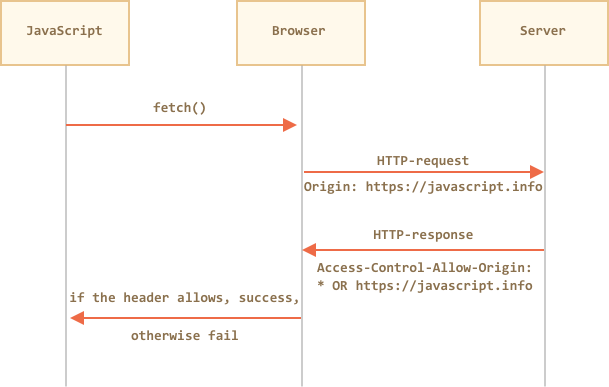
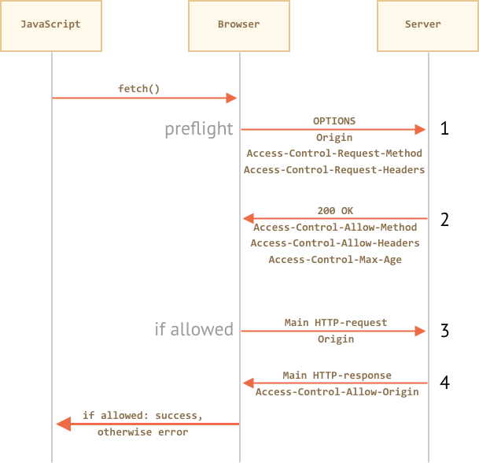

# Fetch：跨源请求

如果我们对任意网站发起 `fetch` 请求，那可能会出现失败。

这里的核心概念是 *origin* —— 域（domain）/端口（port）/协议（protocol）的组合。

跨源请求 —— 那些发送到其他域（即使是子域）、协议或者端口 —— 要求服务端提供特殊的头。这个政策被称为“CORS”：跨域资源共享（Cross-Origin Resource Sharing）。

例如，我们尝试获取 `http://example.com`：

```js run async
try {
  await fetch('http://example.com');
} catch(err) {
  alert(err); // 无法获取
}
```

不出意外，获取失败。

## 为什么？

因为跨源限制可以保护互联网免受恶意黑客攻击。

Seriously。这里我们跑个题简单说下它的历史。

多年来，JavaScript 没有任何特殊的方法来执行网络请求。

**来自一个网站的脚本无法访问其他网站的内容**

这个简单有力的规则是互联网安全的基础。例如，来自 `hacker.com` 页面的脚本无法访问 `gmail.com` 上的用户邮箱。基于这样的规则，人们感到很安全。

但是网络开发人员需要更多的控制权。人们发明了各种各样的技巧去解决它。

其中一种和其他服务器通信的方法是提交一个 `<form>`。人们将它提交到 `<iframe>` ，只是为了仍然留在当前页面，像这样：

```html
<!-- form 目标 -->
<iframe name="iframe"></iframe>

<!-- form 可以使用 JavaScript 动态生成并提交 -->
<form target="iframe" method="POST" action="http://another.com/…">
  ...
</form>

```

- 因此，即使没有网络方法，它也可以向其他网站发起一个 GET/POST 请求。
- 但是由于禁止从另一个站点访问 `<iframe>` 的内容，因此无法读取响应。

所以，`<form>` 允许在任何位置提交数据，但是响应内容无法访问。

另一个技巧是使用 `<script src="http://another.com/…">` 标签。脚本元素可以有来自任何域的任何 `src` 值。但同样 —— 无法访问此类脚本的原始内容。

如果 `another.com` 试图公开这种访问的数据，则使用所谓的“JSONP（JSON with padding）”协议。

以下是它的工作流程：

1. 首先，我们提前声明一个全局函数来接收数据，例如 `gotWeather`。
2. 然后我们创建 `<script>` 并将它的名字作为 `callback` 查询参数，就像这样 `src="http://another.com/weather.json?callback=gotWeather"`。
3. 服务器动态生成响应，将所有数据包裹到 `gotWeather(...)` 调用内。
4. 当脚本执行的时候，gotWeather` 运行，并且因为它是我们的函数，我们就有需要的数据了。

这是在 JSONP 中接收数据的演示代码：

```js run
// 1. 声明处理数据的函数
function gotWeather({ temperature, humidity }) {
  alert(`temperature: ${temperature}, humidity: ${humidity}`);
}

// 2. 将名字作为脚本的 callback 参数传递
let script = document.createElement('script');
script.src = `https://cors.javascript.info/article/fetch-crossorigin/demo/script?callback=gotWeather`;
document.body.append(script);

// 3. 期望来自服务器的结果如下：
/*
gotWeather({
  temperature: 25,
  humidity: 78
});
*/
```


这是可行的，并且不违反安全规定，因为双方网站都接受这种传递数据的方式。既然双方网站都同意这种行为，那么它肯定不是网络攻击了。现在仍然有提供这种访问的服务，因为它甚至适用于非常旧的浏览器。

不久之后，出现了更为现代的方式。起初，跨源请求是被禁止的。但是由于长时间的讨论，跨源请求最终被允许，除非服务器明确允许，否则不会添加任何功能。

## 简单请求（Simple requests）

[简单请求](http://www.w3.org/TR/cors/#terminology) 必须满足下列条件：

1. [简单请求方法](http://www.w3.org/TR/cors/#simple-method)：GET, POST 或 HEAD
2. [简单请求头](http://www.w3.org/TR/cors/#simple-header) —— 仅允许下列属性：
    - `Accept`，
    - `Accept-Language`，
    - `Content-Language`，
    - `Content-Type` 的值为 `application/x-www-form-urlencoded`， `multipart/form-data` 或 `text/plain`.

任何其他的请求都被视为“非简单请求（non-simple）”。例如，具有 `PUT` 方法或者 `API-Key` HTTP 头的请求就不是简单请求了。

**本质区别在于，可以使用 `<form>` 或者 `<script>` 进行“简单请求”，而无需任何特殊方法。**

所以，即使是非常旧的服务器也应该准备好接受简单请求。

与此相反，请使用非标准头，或比如 `DELETE` 方法就不能以这种方式创建。在很长一段时间内，JavaScript 都不能建立这样的请求。所以，旧的服务器可能会认为此类请求来自具有特权的来源，“因为网页无法发送它们”。

当我们试图建立非简单请求时，浏览器发送一个特殊的“预检（preflight）”请求到服务器 —— 是否接受这类跨源请求吗？

并且，除非服务器明确确认带有头，否则非简单请求不会被发送。

现在，我们将详细介绍它们。所有这些都有一个目的 —— 那就是确保只有来自服务器的明确许可才能访问新的跨源功能。

## 用于简单请求的 CORS

如果一个请求是跨源的，浏览器始终会向其添加 `Origin` 头。

例如，如果我们从 `https://javascript.info/page` 请求 `https://anywhere.com/request`，请求头就类似于：

```
GET /request
Host: anywhere.com
*!*
Origin: https://javascript.info
*/!*
...
```

正如你所见，`Origin` 包含完整的源（domain/protocol/port），没有路径。

服务器可以检查 `Origin`，如果同意接受这样的请求，就会在响应中添加一个特殊的头 `Access-Control-Allow-Origin`。该头包含了允许的源（在我们实例中是 `https://javascript.info`），或者星号 `*`。然后响应成功，否则报错。

浏览器在这里扮演受信任的中间人角色：
1. 它确保通过跨域请求发送正确的 `Origin`。
2. 如果在响应中检查出正确的 `Access-Control-Allow-Origin`，如果是，则访问 JavaScript，否则被禁止并报错。



这里是一个“接受（accepting）”响应的示例：
```
200 OK
Content-Type:text/html; charset=UTF-8
*!*
Access-Control-Allow-Origin: https://javascript.info
*/!*
```

## 响应头（Response headers）

对于跨源请求，默认情况下 JavaScript 只能访问“简单响应头”：

- `Cache-Control`
- `Content-Language`
- `Content-Type`
- `Expires`
- `Last-Modified`
- `Pragma`

任何其他响应头都是禁止的。

```smart header="请注意：没有 `Content-Length`"
请注意：列表中没有 `Content-Length` 头！

所以，如果我们想要追踪下载内容的进度百分比，则需要额外的权限才能访问该头（参见下文）。
```

要允许 JavaScript 访问任何其他响应头，服务器必须在响应头中列出 `Access-Control-Expose-Headers`。

例如：

```
200 OK
Content-Type:text/html; charset=UTF-8
Content-Length: 12345
API-Key: 2c9de507f2c54aa1
Access-Control-Allow-Origin: https://javascript.info
*!*
Access-Control-Expose-Headers: Content-Length,API-Key
*/!*
```

有了 `Access-Control-Expose-Headers` 响应头，脚本就有权限访问响应的 `Content-Length` 和 `API-Key` 头。


## "非简单" requests

我们可以使用任何 HTTP 方法：不仅仅是 `GET/POST`，也可以是 `PATCH`，`DELETE`  及其他。

之前，没有人能够设想网页能做出这样的请求。所以可能存在有些网络服务视非标准方法为一个信号：“这不是浏览器”。它们可以在检查访问权限时将其考虑在内。

因此，为了避免误解，任何“非标准”请求 —— 在过去无法完成，浏览器不会立即发出此类请求。在它发送请求前，会先发送“预检请求”来获取权限。

预检请求使用 `OPTIONS` 方法，并且没有 body。
- `Access-Control-Request-Method` 头具有请求方法。
- `Access-Control-Request-Headers` 头提供以逗号分隔的非简单 HTTP 头列表。

如果服务器同意请求，那么它响应状态码应该为 200，没有 body。

- 响应头 `Access-Control-Allow-Methods` 必须具有允许的方法。
- 响应头 `Access-Control-Allow-Headers` 必须具有允许的头列表。
- 另外，响应头 `Access-Control-Max-Age` 可以指定缓存此权限的秒数。因此，浏览器不必为满足给定权限的后续请求发送预检。



让我们用一个例子来一步步展示它是怎么工作的，对于跨域的 `PATCH` 请求（这个方法通常被用来上传数据）：

```js
let response = await fetch('https://site.com/service.json', {
  method: 'PATCH',
  headers: {
    'Content-Type': 'application/json'  
    'API-Key': 'secret'
  }
});
```

这里有三个理由解释为什么它不是一个简单请求（其实一个就够了）：
- 方法：`PATCH`
- `Content-Type` 不是这三个中的一个：`application/x-www-form-urlencoded`，`multipart/form-data`，`text/plain`。
- 自定义 `API-Key` 头。

### Step 1 预检请求（preflight request）

浏览器自身会发送类似这样的预检请求：

```
OPTIONS /service.json
Host: site.com
Origin: https://javascript.info
Access-Control-Request-Method: PATCH
Access-Control-Request-Headers: Content-Type,API-Key
```

- 方法：`OPTIONS`。
- 路径 —— 与主请求完全相同：`/service.json`。
- 特殊跨源头：
    - `Origin` —— 来源。
    - `Access-Control-Request-Method` —— 请求方法。
    - `Access-Control-Request-Headers` —— 以逗号分隔的“非简单”头列表。

### Step 2 预检响应（preflight response）

服务应响应状态 200 和 响应头：
- `Access-Control-Allow-Methods: PATCH`
- `Access-Control-Allow-Headers: Content-Type,API-Key`.

这将允许后续通信，否则会触发错误。

如果服务器需要其他的方法和头，请一次性将它们全部列出来，例如：

```
200 OK
Access-Control-Allow-Methods: PUT,PATCH,DELETE
Access-Control-Allow-Headers: API-Key,Content-Type,If-Modified-Since,Cache-Control
Access-Control-Max-Age: 86400
```

现在，浏览器可以在允许的方法列表里找到 `PATCH`，并且这两个头也都在列表中，因此它发送主请求。

此外，预检请求会按指定时间缓存，由 `Access-Control-Max-Age` 头指定（86400 秒，一天），因此，后续请求将不会再发送预检请求。假设它们符合配额，它们将直接发送。

### Step 3 实际请求（actual request）

当预检请求成功后，浏览器将会发送实际请求。这里的流程和简单请求相同。

实际请求有 `Origin` 头（因为它是跨源的）：

```
PATCH /service.json
Host: site.com
Content-Type: application/json
API-Key: secret
Origin: https://javascript.info
```

### Step 4 实际响应（actual response）

服务器不应该忘记添加 `Access-Control-Allow-Origin` 到响应中。/TODO/A successful preflight does not relieve from that:

```
Access-Control-Allow-Origin: https://javascript.info
```

现在所有事情都是正确的。JavaScript 可以读取完整的响应了。


## 凭据（Credentials）

默认情况下，跨源请求不会带来任何凭据（cookies 或者 HTTP 认证（HTTP authentication））。

这对于 HTTP 请求来说并不常见。通常，对 `http://site.com` 的请求附带来自该域的所有 cookies。但是对于 JavaScript 方法建立的跨源请求是个例外。

例如，`fetch('http://another.com')` 不会发送任何 cookies，甚至那些属于 `another.com` 域的 cookies。

为什么？

这是因为具有凭据的请求比匿名请求具有的权限更大。如果被允许，它授予 JavaScript 代表用户行为和访问敏感信息的全部权限。

服务器真的这么信任来自 `Origin` 的页面吗？具有凭据的请求需要额外的头才能通过。

要启用凭据，我们需要添加选项 `credentials: "include"`，就像这样：

```js
fetch('http://another.com', {
  credentials: "include"
});
```

现在，`fetch` 会根据请求发送源自 `another.com` 的 cookies。

如果服务器想要接受带有凭据的请求，则除了 `Access-Control-Allow-Origin` 外，它还需要向响应头中添加 `Access-Control-Allow-Credentials: true`。

例如：

```
200 OK
Access-Control-Allow-Origin: https://javascript.info
Access-Control-Allow-Credentials: true
```

请注意：对于具有凭据的请求，禁止使用 `Access-Control-Allow-Origin` 为 `*`。它必须有一个确切的源，像上面一样。这是一项额外的安全措施，以确保服务器真正知道它信任谁。


## 总结

网络方法将跨源请求分为两类：“简单”请求和除“简单”请求之外其他的请求。

[简单请求](http://www.w3.org/TR/cors/#terminology) 必须满足下列条件：
- 方法：GET，POST 或 HEAD。
- 头 —— 我们仅能设置：
    - `Accept`
    - `Accept-Language`
    - `Content-Language`
    - `Content-Type` 的值为 `application/x-www-form-urlencoded`，`multipart/form-data` 或 `text/plain`。

简单请求和其他请求的本质区别在于，自古以来使用 `<form>` 或 `<script>` 标签就可以发送简单请求，而长期来浏览器都不能使用非简单请求。

所以，实际区别在于简单请求会使用 `Origin` 头并立即发送，而对于其他请求，浏览器会发出初步的预检请求，请求获得许可。

**对于简单请求：**

- → 浏览器发送带有源的 `Origin` 头。
- ← 对于没有凭据的请求（默认），服务器应该设置：
    - `Access-Control-Allow-Origin` 为 `*` 或与 `Origin` 相同
- ← 对于具有凭据的请求，服务器应该设置：
    - `Access-Control-Allow-Origin` 为 `Origin`
    - `Access-Control-Allow-Credentials` 为 `true`

此外，如果 JavaScript 期望访问非简单响应头：
- `Cache-Control`
- `Content-Language`
- `Content-Type`
- `Expires`
- `Last-Modified`
- `Pragma`

...服务器应列出 `Access-Control-Expose-Headers` 头中允许的那些：

**对于非简单请求，会在请求之前发出初步“预检”请求：

- → 浏览器发送 `OPTIONS` 请求到相同的 url，同时具有下列头：
    - `Access-Control-Request-Method` 请求方法。
    - `Access-Control-Request-Headers` 非简单请求头列表
- ← 服务器应该响应状态码为 200 和响应头：
    - `Access-Control-Allow-Methods` 具有一系列允许方法的列表，
    - `Access-Control-Allow-Headers` 具有一系列允许头的列表，
    - `Access-Control-Max-Age` 用指定数字来缓存权限。
- 最后发出实际请求，应用先前的“简单”方案。
