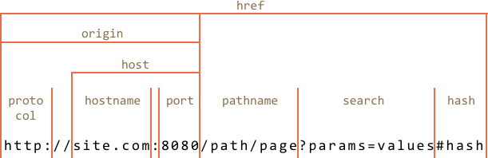

# URL 对象

内置的 [URL](https://url.spec.whatwg.org/#api) 类为创建和解析 URLs 提供了非常方便的接口。

我们根本不需要使用它。没有一个网络方法只需要一个 `URL` 对象，字符串就足够了。但有时候它真的很有用。

## 创建 URL

创建新的 URL 对象的语法：

```js
new URL(url, [base])
```

- **`url`** —— url 文本地址
- **`base`** —— 可选的 `url` 根地址

`URL` 对象立即允许我们访问其组件，因此这是一个解析网址的好办法，例如：

```js run
let url = new URL('https://javascript.info/url');

alert(url.protocol); // https:
alert(url.host);     // javascript.info
alert(url.pathname); // /url
```

这是其组件列表：



- `href` 是完整的 url，与 `url.toString()` 相同
- `protocol` 以冒号字符 `:` 结尾
- `search` 以问号 `?` 开始
- `hash` 以哈希字符 `#` 开头
- 如果存在 HTTP 身份验证的话，通常还会有 `user` 和 `password` 属性。

我们还可以使用 `URL` 的第二个参数来创建相对 urls：

```js run
let url = new URL('profile/admin', 'https://javascript.info');

alert(url); // https://javascript.info/profile/admin

url = new URL('tester', url); // 转到相对于当前 url 路径的 'tester'

alert(url); // https://javascript.info/profile/tester
```

```smart header="我们可以在任何地方使用 `URL` 代替字符串"
我们可以在 `fetch` 或者 `XMLHttpRequest` 里使用 `URL` 对象，几乎所有能使用字符串 url 的地方都能使用它。

在绝大多数方法中，它会自动转换成字符串。
```

## 搜索参数（SearchParams）

假设我们想要以给定的搜索词来创建 url，例如，`https://google.com/search?query=value`。

它们必须被正确编码。

在古老的浏览器中，`URL` 出现之前，我们使用的是内置函数 `encodeURIComponent/decodeURIComponent`。

现在，我们不必使用它们了：`url.searchParams` 是 [URLSearchParams](https://url.spec.whatwg.org/#urlsearchparams) 类型的对象。

它为搜索参数提供了便捷的方法：

- **`append(name, value)`** —— 添加参数，
- **`delete(name)`** —— 移除参数，
- **`get(name)`** —— 获取参数，
- **`getAll(name)`** —— 获取给定名称的所有参数（如果有很多个参数的话，例如：`?user=John&user=Pete`），
- **`has(name)`** —— 检查参数是否存在，
- **`set(name, value)`** —— set/replace 参数，
- **`sort()`** —— 按名称排序参数，很少需要这样做，
- ...并且是可迭代的，类似于 `Map`。

即 `URL` 对象为操作 url 参数提供了一种的简便方法。

例如：

```js run
let url = new URL('https://google.com/search');
url.searchParams.set('query', 'test me!');

alert(url); // https://google.com/search?query=test+me%21

url.searchParams.set('tbs', 'qdr:y'); // 添加日期范围参数：past year

alert(url); // https://google.com/search?query=test+me%21&tbs=qdr%3Ay

// iterate over search parameters (decoded)
for(let [name, value] of url.searchParams) {
  alert(`${name}=${value}`); // query=test me!，然后是 tbs=qdr:y
}
```
