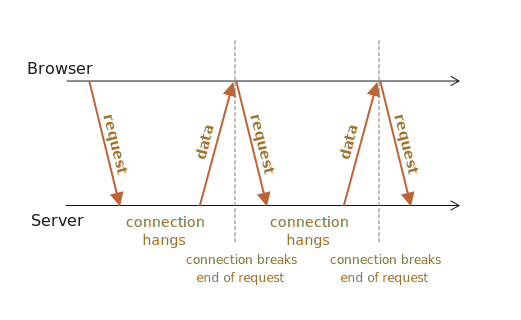

# 长轮询（Long polling）

长轮询是与服务器保持持久连接的最简单的方式，它不使用任何特定的协议，例如 WebSocket 或者 Server Sent Event。

它很容易实现，在很多场景下也很好用。

## 常规轮询

从服务器获取新信息的最简单的方式是定期轮询。也就是说，定期向服务器发出请求：“你好，我在这儿，你有关于我的任何信息吗？”例如，每 10 秒一次。

作为响应，服务器首先通知自己，客户端处于在线状态，然后 —— 发送目前为止的消息包。

这可行，但是也有些缺点：
1. 消息传递的延迟最多为 10 秒（两个请求之间）。
2. 即使没有消息，服务器也会每隔 10 秒被请求轰炸一次，即使用户切换到其他地方或者处于休眠状态，也是如此。就性能而言，这是一个很大的负担。

因此，如果我们讨论的是一个非常小的服务，那么这种方式可能可行，但总的来说，它需要改进。

## 长轮询

所谓“长轮询”是轮询服务器的一种更好的方式。

它也很容易实现，并且可以无延迟地传递消息。

其流程为：

1. 请求发送到服务器。
2. 服务器在有消息之前不会关闭连接。
3. 当消息出现时 —— 服务器将对其请求作出响应。
4. 浏览器立即发出一个新的请求。

对于此方法，浏览器发出一个请求并与服务器之间建立起一个挂起的（pending）连接的情况是标准的。仅在有消息被传递时，才会重新建立连接。



如果连接丢失，可能是因为网络错误，浏览器会立即发送一个新请求。

实现长轮询的客户端 `subscribe` 函数的示例代码：

```js
async function subscribe() {
  let response = await fetch("/subscribe");

  if (response.status == 502) {
    // 状态 502 是连接超时错误，
    // 连接挂起时间过长时可能会发生，
    // 远程服务器或代理会关闭它
    // 让我们重新连接
    await subscribe();
  } else if (response.status != 200) {
    // 一个 error —— 让我们显示它
    showMessage(response.statusText);
    // 一秒后重新连接
    await new Promise(resolve => setTimeout(resolve, 1000));
    await subscribe();
  } else {
    // 获取并显示消息
    let message = await response.text();
    showMessage(message);
    //再次调用 subscribe() 以获取下一条消息
    await subscribe();
  }
}

subscribe();
```

正如你所看到的，`subscribe` 函数发起了一个 `fetch`，然后等待响应，处理它，并再次调用自身。

```warn header="服务器应该可以处理许多挂起的连接"
服务器架构必须能够处理许多挂起连接。

某些服务器架构是每个连接对应一个进程。对于许多连接的情况，可能会有许多进程，每个进程占用很多内存。因此连接越多消耗也就越多。

这种情况通常是对于使用 PHP，Ruby 语言的后端，但是从技术上来说，它不是一种语言，而是实现的问题。

使用 Node.js 写的后端通常不会出现这样的问题。
```

## Demo：chat

这是一个 demo：

[codetabs src="longpoll" height=500]

## 使用场景

在消息很少的情况下，长轮询很有效。

如果消息比较频繁，那么上面描绘的请求接收（requesting-receiving）消息的图表就会变成锯状（saw-like）。

每条消息都是单独的请求，带有 headers，authentication 等开销。

因此，在这种情况下，首选另一种方法，例如：[Websocket](info:websocket) 或者 [Server Sent Events](info:server-sent-events)。
