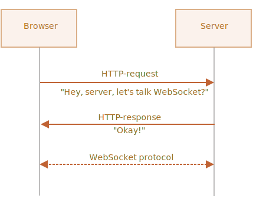

# WebSocket

在 [RFC 6455](http://tools.ietf.org/html/rfc6455) 规范中描述的 `WebSocket` 协议提供了一种在浏览器和服务器之间建立持久连接的通信方法。

一旦 Websocket 连接建立，客户端和服务端就能互相发送数据了。

WebSocket 特别适用于连续数据交换的服务，例如在线游戏，实时交易系统等等。

## 一个简单例子

要打开 Websocket 连接，我们需要在 url 中使用特殊的协议 `ws` 创建 `new WebSocket`：

```js
let socket = new WebSocket("*!*ws*/!*://javascript.info");
```

同样也有一个加密协议 `wss://`。类似于 Websocket 中的 HTTPS。

```smart header="始终使用 `wss://`"
`wss://` 协议不仅能加密，而且更可靠。

一方面是因为 `ws://` 数据不是加密的，对于任何中间人来说其数据都是可见的。另一方面是因为过去的代理服务还不知道 WebSocket，它们可能因为识别到这个“奇怪的”头而终止连接。

另外，`wss://` 是基于 TLS 的 WebSocket，（类似于 HTTPS 是 HTTP 基于 TLS），传输安全层（transport security layer）加密发送方的数据并在接收方解密，因此它通过代理加密传递。它们看不到传输的内容且会让这些数据通过。
```

当 socket 建立后，我们就应该侦听 socket 上的事件。一共有 4 个事件：
- **`open`** —— 连接建立，
- **`message`** —— 数据接收，
- **`error`** —— Websocket 错误，
- **`close`** —— 连接关闭。

……如果我们想要发送数据，可以使用 `socket.send(data)`。

下面是它的一个例子：

```js run
let socket = new WebSocket("wss://javascript.info/article/websocket/demo/hello");

socket.onopen = function(e) {
  alert("[open] Connection established, send -> server");
  socket.send("My name is John");
};

socket.onmessage = function(event) {
  alert(`[message] Data received: ${event.data} <- server`);
};

socket.onclose = function(event) {
  if (event.wasClean) {  
    alert(`[close] Connection closed cleanly, code=${event.code} reason=${event.reason}`);
  } else {
    // 例如，服务进程关闭或者网络出现问题
    // 在这种情况下 event.code 通常是 1006
    alert('[close] Connection died');
  }
};

socket.onerror = function(error) {
  alert(`[error] ${error.message}`);
};
```

出于演示目的，这里有一个用 Node.js 写的小型服务器 [server.js](demo/server.js)，你可以运行它以体验上面的例子。它以“hello”响应，等待 5 秒后关闭连接。

所以你看到的事件顺序为：`open` -> `message` -> `close`。

这就是 WebSocket，我们已经可以使用 WebSocket 通信了。很简单，不是吗？

现在我们更深入讨论一下。

## 建立 WebSocket

当 `new WebSocket(url)` 被创建后，它立即开始连接。

在连接期间，浏览器（通过请求头）问服务器：“你支持 Websocket 吗？”如果服务器回复说“我支持 Websocket”，那么通信就以 Websocket 协议继续进行，而不是 HTTP 形式。



这是一个浏览器请求的例子：`new WebSocket("wss://javascript.info/chat")`。

```
GET /chat
Host: javascript.info
Origin: https://javascript.info
Connection: Upgrade
Upgrade: websocket
Sec-WebSocket-Key: Iv8io/9s+lYFgZWcXczP8Q==
Sec-WebSocket-Version: 13
```

- `Origin` —— 客户端页面的 origin，例如：`https://javascript.info`。WebSocket 对象原生支持 cross-origin。没有特殊的头与限制。以前的服务器不能处理 WebSocket，因此不存在任何兼容性问题。但是 `Origin` 请求头很重要，因为它允许服务器做出决定是否使用 WebSocket 与该网站通信。
- `Connection: Upgrade` —— 表示客户端想要更改协议。
- `Upgrade: websocket` —— 请求更改为“websocket”协议。
- `Sec-WebSocket-Key` —— 浏览器随机生成的安全密钥。
- `Sec-WebSocket-Version` —— WebSocket 协议版本，当前为 13。

```smart header="无法模拟 WebSocket 握手（handshake）"
我们不能使用 `XMLHttpRequest` 或者 `fetch` 来模拟这种 HTTP 请求，因为 JavaScript 不允许设置这些请求头。
```

如果服务器同意转换为 WebSocket 协议，服务器就会返回响应代码 101：

```
101 Switching Protocols
Upgrade: websocket
Connection: Upgrade
Sec-WebSocket-Accept: hsBlbuDTkk24srzEOTBUlZAlC2g=
```

`Sec-WebSocket-Accept` 是 `Sec-WebSocket-Key`，使用特殊的算法重新编码。浏览器以此来确保响应正确的请求。

然后，数据就使用 WebSocket 协议传输，我们很快就会看到它的结构（“frames”）。它和 HTTP 有着本质上的区别。

### 扩展（extensions）和子协议（subprotocols）

WebSocket 有其他的头 `Sec-WebSocket-Extensions` 和 `Sec-WebSocket-Protocol` 描述扩展和子协议。

例如：

- `Sec-WebSocket-Extensions: deflate-frame` 表示浏览器支持数据压缩。扩展与传输数据有关而与数据本身无关。

- `Sec-WebSocket-Protocol: soap, wamp` 表示我们不仅要传输任何数据，还要传输 [SOAP](http://en.wikipedia.org/wiki/SOAP) 或者 WAMP（“The WebSocket Application Messaging Protocol”）协议内的数据。WebSocket 子协议已经在 [IANA catalogue](http://www.iana.org/assignments/websocket/websocket.xml) 中注册。

`Sec-WebSocket-Extensions` 请求头是浏览器自动发送的，其中包含可能支持的扩展列表。

`Sec-WebSocket-Protocol` 请求头由我们设置：我们确定我们发送的是什么类型的数据。`new WebSocket` 的第二个可选参数就是为此而生，子协议列表为：

```js
let socket = new WebSocket("wss://javascript.info/chat", ["soap", "wamp"]);
```

服务器应响应它支持的协议和扩展的列表。

例如，请求如下：

```
GET /chat
Host: javascript.info
Upgrade: websocket
Connection: Upgrade
Origin: https://javascript.info
Sec-WebSocket-Key: Iv8io/9s+lYFgZWcXczP8Q==
Sec-WebSocket-Version: 13
*!*
Sec-WebSocket-Extensions: deflate-frame
Sec-WebSocket-Protocol: soap, wamp
*/!*
```

响应：

```
101 Switching Protocols
Upgrade: websocket
Connection: Upgrade
Sec-WebSocket-Accept: hsBlbuDTkk24srzEOTBUlZAlC2g=
*!*
Sec-WebSocket-Extensions: deflate-frame
Sec-WebSocket-Protocol: soap
*/!*
```

通过服务器响应可以知道它支持“deflate-frame”扩展以及仅支持 SOAP 的请求子协议。

## WebSocket 数据

WebSocket 通信由“frames”组成 —— 数据片段，可以从任何一方发送，有以下几种：

- "text frames" —— 包含各方发送给彼此的文本数据。
- "binary data frames" —— 包含各方发送给彼此的二进制数据。
- "ping/pong frames" 被用来检查从服务器发送的连接，浏览器自动响应这些数据。
- "connection close frame" 以及其他服务 frames。

在浏览器里，我们只直接使用文本或者二进制数据。

**WebSocket `.send()` 方法也可以发送文本或者二进制数据。**

一个名为 `socket.send(body)` 的方法允许 `body` 是字符串或者二进制格式，包括 `Blob`，`ArrayBuffer` 等等。不需要额外的设置：直接发送它们就可以了。

**当我们接收到了数据后，文本总是以字符串形式呈现。而对于二进制数据，我们可以选择 `Blob` 和 `ArrayBuffer` 形式。**

`socket.bufferType` 默认为 `"blob"`，因此二进制数据通常以 Blob 形式呈现。

[Blob](info:blob) 是高级的（high-level）二进制对象，它直接与 `<a>`，`` 等其他标签集成，因此以 Blob 为默认形式是合理的行为。但是对于二进制处理，要访问单个数据字节，我们可以将默认的 Blob 修改为 `"arraybuffer"`：

```js
socket.bufferType = "arraybuffer";
socket.onmessage = (event) => {
  // event.data 是字符串（如果是文本）或者 arraybuffer（如果是二进制）
};
```

## 限速（Rate limiting）

想象一下这种情况：我们的应用生成了很多要发送的数据。但是用户端的网速却很慢，可能是在乡下的移动设备上。

我们可以反复调用 `socket.send(data)`。但是数据将会缓冲（buffered）（储存 stored）在内存中，并且只能在网络速度允许的情况下快速发送出去。

`socket.bufferedAmount` 属性储存此时缓冲的字节数，等待通过网络发送。

我们可以检查它以查看 socket 是否真的可用于传输。

```js
// 每 100ms 检查一次 socket 并发送更多数据
// 仅当所有现有的数据都被发送出去
setInterval(() => {
  if (socket.bufferedAmount == 0) {
    socket.send(moreData());
  }
}, 100);
```


## 连接关闭（Connection close）

通常，当一方想要关闭连接时（浏览器和服务器都有相同的权限），它们会发送带有状态码（numeric code）和文本形式的原因的 “connection close frame”。

它的方法是：
```js
socket.close([code], [reason]);
```

- `code` 是一个特殊的 WebSocket 状态码（可选）
- `reason` 是一个描述关闭连接的原因的字符串（可选）

然后，另外一方通过 `close` 事件处理器获取了状态码和关闭原因，例如：

```js
// 关闭方：
socket.close(1000, "Work complete");

// 另一方
socket.onclose = event => {
  // event.code === 1000
  // event.reason === "Work complete"
  // event.wasClean === true（完成关闭）
};
```

常见状态码：

- `1000` —— 默认，正常关闭（如果没有指明 `code` 时使用它），
- `1006` —— 没有办法手动指定这个值，表示连接丢失（没有 close frame）。

以及其他值：

- `1001` —— 一方打算离开，例如：服务器正在关机，或者从浏览器上离开页面，
- `1009` —— 消息太长而不能处理，
- `1011` —— 服务器意外出错，
- ……等等。

请参阅 [RFC6455, §7.4.1](https://tools.ietf.org/html/rfc6455#section-7.4.1) 以了解更多连接关闭状态码。

WebSocket 状态码有点像 HTTP 状态码，但它们是不同的。特别是当我们尝试设置任何小于 `1000` 的状态码时将会出错。

```js
// 如果连接断开
socket.onclose = event => {
  // event.code === 1006
  // event.reason === ""
  // event.wasClean === false（没有 closing frame）
};
```


## 连接状态（Connection state）

要获取连接状态，可以通过 `socket.readyState` 属性值来获取：

- **`0`** —— “CONNECTING”：连接还未建立，
- **`1`** —— “OPEN”：通信中，
- **`2`** —— “CLOSING”：连接关闭中，
- **`3`** —— “CLOSED”：连接已关闭。


## Chat 例子

让我们通过浏览器的 WebSocket API 和 Node.js 的 WebSocket 模块 <https://github.com/websockets/ws> 来回顾一下上述 chat 例子。

HTML：`<form>` 用于发送消息，`<div>` 用于显示接收到的消息：

```html
<!-- 消息 form -->
<form name="publish">
  <input type="text" name="message">
  <input type="submit" value="Send">
</form>

<!-- div 显示消息 -->
<div id="messages"></div>
```

JavaScript 代码也很简单。我们打开一个 socket，然后提交表单 —— `socket.send(message)`，对于传入的消息 —— 附加到 `div#messages` 上即可：

```js
let socket = new WebSocket("wss://javascript.info/article/websocket/chat/ws");

// form 发送消息
document.forms.publish.onsubmit = function() {
  let outgoingMessage = this.message.value;

  socket.send(outgoingMessage);
  return false;
};

// div#messages 显示消息
socket.onmessage = function(event) {
  let message = event.data;

  let messageElem = document.createElement('div');
  messageElem.textContent = message;
  document.getElementById('messages').prepend(messageElem);
}
```

服务端代码有点超出我们的范围。我们使用的是浏览器 WebSocket API，服务端有其他库可用。

但它仍然很简单。我们将 Node.js 与 <https://github.com/websockets/ws> 模块一起用于 Websocket。

服务端算法为：
1. 创建 `clients = new Set()` —— 一系列 sockets。
2. 对于每个可接受的 Websocket，`clients.add(socket)` 并为其消息添加 `message` 事件侦听器。
3. 当接收到消息：迭代所有客户端，并将消息发送给每个人。
4. 当连接关闭时：`clients.delete(socket)`。

```js
const ws = new require('ws');
const wss = new ws.Server({noServer: true});

const clients = new Set();

http.createServer((req, res) => {
  // 我们在这里仅处理 Websocket 连接
  // 在实际例子中我们将会有其他代码来处理非 Websocket 请求
  wss.handleUpgrade(req, req.socket, Buffer.alloc(0), onSocketConnect);
});

function onSocketConnect(ws) {
  clients.add(ws);

  ws.on('message', function(message) {
    message = message.slice(0, 50); // 最大消息长度为 50

    for(let client of clients) {
      client.send(message);
    }
  });

  ws.on('close', function() {
    clients.delete(ws);
  });
}
```


这里是运行示例：

[iframe src="chat" height="100" zip]

你也可以下载它（点击 iframe 右上角按钮可下载）然后在本地运行。运行之前请记得安装 [Node.js](https://nodejs.org/en/) 和 `npm install ws`。


## 总结

WebSocket 是一种在浏览器和服务器之间建立持久连接的现代方式。

- WebSockets 没有跨域限制。
- 浏览器对 WebSockets 支持很好。
- 可以发送/接收字符串和二进制数据。

WebSockets 的 API 很简单。

WebSockets 方法：
- `socket.send(data)`，
- `socket.close([code], [reason])`。

WebSockets 事件：
- `open`，
- `message`，
- `error`，
- `close`。

WebSocket 自身并不包含重新连接（reconnection），身份验证（authentication）和许多其他高级机制。因此有针对于此的客户端/服务端的库，并且可以手动实现这些功能。

有时候，为了将 WebSocket 集成到现有项目中，人们将主 HTTP 服务与 WebSocket 服务并行运行，并且它们之间共享同一个数据库。对于 WebSocket 请求使用一个通向 WebSocket 服务器的子域 `wss://ws.site.com`，而 `https://site.com` 则转到主 HTTP 服务器。

当然，其他集成方式也是可行的。许多服务器（例如 Node.js）可以同时支持 HTTP 和 WebSocket 协议。
