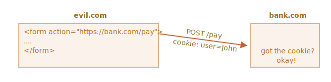

<<<<<<< HEAD
# Cookie，document.cookie

Cookie 是直接存储在浏览器中的一小串数据。它们是 HTTP 协议的一部分，由 [RFC 6265](https://tools.ietf.org/html/rfc6265) 规范定义。

Cookie 通常是由 Web 服务器使用响应 `Set-Cookie` HTTP-header 设置的。然后浏览器使用 `Cookie` HTTP-header 将它们自动添加到（几乎）每个对相同域的请求中。

最常见的用处之一就是身份验证：

1. 登录后，服务器在响应中使用 `Set-Cookie` HTTP-header 来设置具有唯一“会话标识符（session identifier）”的 cookie。
2. 下次如果请求是由相同域发起的，浏览器会使用 `Cookie` HTTP-header 通过网络发送 cookie。
3. 所以服务器知道是谁发起了请求。

我们还可以使用 `document.cookie` 属性从浏览器访问 cookie。

关于 cookie 及其选项，有很多棘手的事情。在本章中，我们将详细介绍它们。

## 从 document.cookie 中读取

```online
你的浏览器是否存储了本网站的任何 cookie？让我们来看看：
```

```offline
假设你在一个网站上，则可以看到来自该网站的 cookie，像这样：
```

```js run
// 在 javascript.info，我们使用谷歌分析来进行统计，
// 所以应该存在一些 cookie
=======
# Cookies, document.cookie

Cookies are small strings of data that are stored directly in the browser. They are a part of HTTP protocol, defined by [RFC 6265](https://tools.ietf.org/html/rfc6265) specification.

Cookies are usually set by a web-server using response `Set-Cookie` HTTP-header. Then the browser automatically adds them to (almost) every request to the same domain using `Cookie` HTTP-header.

One of the most widespread use cases is authentication:

1. Upon sign in, the server uses `Set-Cookie` HTTP-header in the response to set a cookie with a unique "session identifier".
2. Next time when the request is set to the same domain, the browser sends the cookie over the net using `Cookie` HTTP-header.
3. So the server knows who made the request.

We can also access cookies from the browser, using `document.cookie` property.

There are many tricky things about cookies and their options. In this chapter we'll cover them in detail.

## Reading from document.cookie

```online
Does your browser store any cookies from this site? Let's see:
```

```offline
Assuming you're on a website, it's possible to see the cookies from it, like this:
```

```js run
// At javascript.info, we use Google Analytics for statistics,
// so there should be some cookies
>>>>>>> d35baee32dcce127a69325c274799bb81db1afd8
alert( document.cookie ); // cookie1=value1; cookie2=value2;...
```


<<<<<<< HEAD
`document.cookie` 的值由 `name=value` 对组成，以 `; ` 分隔。每一个都是独立的 cookie。

为了找到一个特定的 cookie，我们可以以 `; ` 作为分隔，将 `document.cookie` 分开，然后找到对应的名字。我们可以使用正则表达式或者数组函数来实现。

我们把这个留给读者当作练习。此外，在本章的最后，你可以找到一些操作 cookie 的辅助函数。

## 写入 document.cookie

我们可以写入 `document.cookie`。但这不是一个数据属性，它是一个访问器（getter/setter）。对其的赋值操作会被特殊处理。

**对 `document.cookie` 的写入操作只会更新其中提到的 cookie，而不会涉及其他 cookie。**

例如，此调用设置了一个名称为 `user` 且值为 `John` 的 cookie：

```js run
document.cookie = "user=John"; // 只会更新名称为 user 的 cookie
alert(document.cookie); // 展示所有 cookie
```

如果你运行了上面这段代码，你会看到多个 cookie。这是因为 `document.cookie=` 操作不是重写整所有 cookie。它只设置代码中提到的 cookie `user`。

从技术上讲，cookie 的名称和值可以是任何字符，为了保持有效的格式，它们应该使用内建的 `encodeURIComponent` 函数对其进行转义：

```js run
// 特殊字符（空格），需要编码
let name = "my name";
let value = "John Smith"

// 将 cookie 编码为 my%20name=John%20Smith
=======
The value of `document.cookie` consists of `name=value` pairs, delimited by `; `. Each one is a separate cookie.

To find a particular cookie, we can split `document.cookie` by `; `, and then find the right name. We can use either a regular expression or array functions to do that.

We leave it as an exercise for the reader. Also, at the end of the chapter you'll find helper functions to manipulate cookies.

## Writing to document.cookie

We can write to `document.cookie`. But it's not a data property, it's an accessor (getter/setter). An assignment to it is treated specially.

**A write operation to `document.cookie` updates only cookies mentioned in it, but doesn't touch other cookies.**

For instance, this call sets a cookie with the name `user` and value `John`:

```js run
document.cookie = "user=John"; // update only cookie named 'user'
alert(document.cookie); // show all cookies
```

If you run it, then probably you'll see multiple cookies. That's because `document.cookie=` operation does not overwrite all cookies. It only sets the mentioned cookie `user`.

Technically, name and value can have any characters, to keep the valid formatting they should be escaped using a built-in `encodeURIComponent` function:

```js run
// special characters (spaces), need encoding
let name = "my name";
let value = "John Smith"

// encodes the cookie as my%20name=John%20Smith
>>>>>>> d35baee32dcce127a69325c274799bb81db1afd8
document.cookie = encodeURIComponent(name) + '=' + encodeURIComponent(value);

alert(document.cookie); // ...; my%20name=John%20Smith
```


<<<<<<< HEAD
```warn header="限制"
存在一些限制：
- `encodeURIComponent` 编码后的 `name=value` 对，大小不能超过 4kb。因此，我们不能在一个 cookie 中保存大的东西。
- 每个域的 cookie 总数不得超过 20+ 左右，具体限制取决于浏览器。
```

Cookie 有几个选项，其中很多都很重要，应该设置它。

选项被列在 `key=value` 之后，以 `;` 分隔，像这样：
=======
```warn header="Limitations"
There are few limitations:
- The `name=value` pair, after `encodeURIComponent`, should not exceed 4kb. So we can't store anything huge in a cookie.
- The total number of cookies per domain is limited to around 20+, the exact limit depends on a browser.
```

Cookies have several options, many of them are important and should be set.

The options are listed after `key=value`, delimited by `;`, like this:
>>>>>>> d35baee32dcce127a69325c274799bb81db1afd8

```js run
document.cookie = "user=John; path=/; expires=Tue, 19 Jan 2038 03:14:07 GMT"
```

## path

- **`path=/mypath`**

<<<<<<< HEAD
url 路径前缀，该路径下的页面可以访问该 cookie。必须是绝对路径。默认为当前路径。

如果一个 cookie 带有 `path=/admin` 设置，那么该 cookie 在 `/admin` 和 `/admin/something` 下都是可见的，但是在 `/home` 或 `/adminpage` 下不可见。

通常，我们应该将 `path` 设置为根目录：`path=/`，以使 cookie 对此网站的所有页面可见。
=======
The url path prefix, the cookie will be accessible for pages under that path. Must be absolute. By default, it's the current path.

If a cookie is set with `path=/admin`, it's visible at pages `/admin` and `/admin/something`, but not at `/home` or `/adminpage`.

Usually, we should set `path` to the root: `path=/` to make the cookie accessible from all website pages.
>>>>>>> d35baee32dcce127a69325c274799bb81db1afd8

## domain

- **`domain=site.com`**

<<<<<<< HEAD
可访问 cookie 的域。但是在实际中，有一些限制。我们无法设置任何域。

默认情况下，cookie 只有在设置的域下才能被访问到。所以，如果 cookie 设置在 `site.com` 下，我们在 `other.com` 下就无法获取它。

……但是棘手的是，我们在子域 `forum.site.com` 下也无法获取它！

```js
// 在 site.com
document.cookie = "user=John"

// 在 forum.site.com
alert(document.cookie); // 没有 user
```

**无法使 cookie 可以被从另一个二级域访问，因此，`other.com` 将永远不会收到设置在 `site.com` 的 cookie。**

这是一项安全限制，为了允许我们可以将敏感信息保存在 cookie 中。

……但是，如果我们想要批准像 `forum.site.com` 这样的子域访问 cookie，这是可以做到的。当我们设置一个在 `site.com` 的 cookie 时，我们应该将 `domain` 选项显式地设置为根域：`domain=site.com`：

```js
// 在 site.com
// 使 cookie 可以被在任何子域 *.site.com 访问：
document.cookie = "user=John; domain=site.com"

// 之后

// 在 forum.site.com
alert(document.cookie); // 有 cookie user=John
```

出于历史原因，`domain=.site.com`（`site.com` 前面有一个点符号）也以相同的方式工作，允许从子域访问 cookie。这是一个旧的表示法，如果我们需要支持非常旧的浏览器，则应该使用它。

所以，`domain` 选项允许设置一个可以在子域访问的 cookie。

## expires，max-age

默认情况下，如果一个 cookie 没有设置这两个参数中的任何一个，那么在关闭浏览器之后，它就会消失。此类 cookie 被称为 "session cookie”。

为了让 cookie 在浏览器关闭后仍然存在，我们可以设置 `expires` 或 `max-age` 选项中的一个。

- **`expires=Tue, 19 Jan 2038 03:14:07 GMT`**

cookie 的到期日期，那时浏览器会自动删除它。

日期必须完全采用 GMT 时区的这种格式。我们可以使用 `date.toUTCString` 来获取它。例如，我们可以将 cookie 设置为 1 天后过期。

```js
// 当前时间 +1 天
=======
A domain where the cookie is accessible. In practice though, there are limitations. We can't set any domain.

By default, a cookie is accessible only at the domain that set it. So, if the cookie was set by `site.com`, we won't get it `other.com`.

...But what's more tricky, we also won't get the cookie at a subdomain `forum.site.com`!

```js
// at site.com
document.cookie = "user=John"

// at forum.site.com
alert(document.cookie); // no user
```

**There's no way to let a cookie be accessible from another 2nd-level domain, so `other.com` will never receive a cookie set at `site.com`.**

It's a safety restriction, to allow us to store sensitive data in cookies, that should be available only on one site.

...But if we'd like to allow subdomains like `forum.site.com` get a cookie, that's possible. When setting a cookie at `site.com`, we should explicitly set `domain` option to the root domain: `domain=site.com`:

```js
// at site.com
// make the cookie accessible on any subdomain *.site.com:
document.cookie = "user=John; domain=site.com"

// later

// at forum.site.com
alert(document.cookie); // has cookie user=John
```

For historical reasons, `domain=.site.com` (a dot before `site.com`) also works the same way, allowing access to the cookie from subdomains. That's an old notation, should be used if we need to support very old browsers.

So, `domain` option allows to make a cookie accessible at subdomains.

## expires, max-age

By default, if a cookie doesn't have one of these options, it disappears when the browser is closed. Such cookies are called "session cookies"

To let cookies survive browser close, we can set either `expires` or `max-age` option.

- **`expires=Tue, 19 Jan 2038 03:14:07 GMT`**

Cookie expiration date, when the browser will delete it automatically.

The date must be exactly in this format, in GMT timezone. We can use `date.toUTCString` to get it. For instance, we can set the cookie to expire in 1 day:

```js
// +1 day from now
>>>>>>> d35baee32dcce127a69325c274799bb81db1afd8
let date = new Date(Date.now() + 86400e3);
date = date.toUTCString();
document.cookie = "user=John; expires=" + date;
```

<<<<<<< HEAD
如果我们将 `expires` 设置为过去的时间，则 cookie 会被删除。

-  **`max-age=3600`**

`expires` 的替代选项，具指明 cookie 的过期时间距离当前时间的秒数。

如果为 0 或负数，则 cookie 会被删除：

```js
// cookie 会在一小时后失效
document.cookie = "user=John; max-age=3600";

// 删除 cookie（让它立即过期）
document.cookie = "user=John; max-age=0";
``` 
=======
If we set `expires` to a date in the past, the cookie is deleted.

-  **`max-age=3600`**

An alternative to `expires`, specifies the cookie expiration in seconds from the current moment.

If zero or negative, then the cookie is deleted:

```js
// cookie will die +1 hour from now
document.cookie = "user=John; max-age=3600";

// delete cookie (let it expire right now)
document.cookie = "user=John; max-age=0";
```
>>>>>>> d35baee32dcce127a69325c274799bb81db1afd8

## secure

- **`secure`**

<<<<<<< HEAD
Cookie 应只能被通过 HTTPS 传输。

**默认情况下，如果我们在 `http://site.com` 上设置了 cookie，那么该 cookie 也会出现在 `https://site.com` 上，反之亦然。**

也就是说，cookie 是基于域的，它们不区分协议。

使用此选项，如果一个 cookie 是通过 `https://site.com` 设置的，那么它不会在相同域的 HTTP 环境下出现，例如 `http://site.com`。所以，如果一个 cookie 包含绝不应该通过未加密的 HTTP 协议发送的敏感内容，那么就应该设置这个选项。

```js
// 假设我们现在在 HTTPS 环境下
// 设置 cookie secure（只在 HTTPS 环境下可访问）
=======
The cookie should be transferred only over HTTPS.

**By default, if we set a cookie at `http://site.com`, then it also appears at `https://site.com` and vice versa.**

That is, cookies are domain-based, they do not distinguish between the protocols.

With this option, if a cookie is set by `https://site.com`, then it doesn't appear when the same site is accessed by HTTP, as `http://site.com`. So if a cookie has sensitive content that should never be sent over unencrypted HTTP, then the flag is the right thing.

```js
// assuming we're on https:// now
// set the cookie secure (only accessible if over HTTPS)
>>>>>>> d35baee32dcce127a69325c274799bb81db1afd8
document.cookie = "user=John; secure";
```  

## samesite

<<<<<<< HEAD
这是另外一个关于安全的特性。它旨在防止 XSRF（跨网站请求伪造）攻击。

为了了解它是如何工作的，以及何时有用，让我们看一下 XSRF 攻击。

### XSRF 攻击

想象一下，你登录了 `bank.com` 网站。此时：你有了来自该网站的身份验证 cookie。你的浏览器会在每次请求时将其发送到 `bank.com`，以便识别你，并执行所有敏感的财务上的操作。

现在，在另外一个窗口中浏览网页时，你不小心访问了另一个网站 `evil.com`。该网站具有向 `bank.com` 网站提交一个具有启动与黑客账户交易的字段的表单 `<form action="https://bank.com/pay">` 的 JavaScript 代码。

你每次访问 `bank.com` 时，浏览器都会发送 cookie，即使该表单是从 `evil.com` 提交过来的。因此，银行会识别你的身份，并执行真实的付款。



这就是“跨网站请求伪造（Cross-Site Request Forgery，简称 XSRF）”攻击。

当然，实际的银行会防止出现这种情况。所有由 `bank.com` 生成的表单都具有一个特殊的字段，即所谓的 “XSRF 保护 token”，恶意页面既不能生成，也不能从远程页面提取它（它可以在那里提交表单，但是无法获取数据）。并且，网站 `bank.com` 会对收到的每个表单都进行这种 token 的检查。

但是，实现这种防护需要花费时间：我们需要确保每个表单都具有 token 字段，并且还必须检查所有请求。

### 输入 cookie samesite 选项

Cookie 的 `samesite` 选项提供了另一种防止此类攻击的方式，（理论上）不需要要求 “XSRF 保护 token”。

它有两个可能的值：

- **`samesite=strict`（和没有值的 `samesite` 一样)**

如果用户来自同一网站之外，那么设置了 `samesite=strict` 的 cookie 永远不会被发送。

换句话说，无论用户是通过邮件链接还是从 `evil.com` 提交表单，或者进行了任何来自其他域下的操作，cookie 都不会被发送。

如果身份验证 cookie 具有 `samesite` 选项，那么 XSRF 攻击是没有机会成功的，因为来自 `evil.com` 的提交没有 cookie。因此，`bank.com` 将无法识别用户，也就不会继续进行付款。

这种保护是相当可靠的。只有来自 `bank.com` 的操作才会发送 `samesite` cookie，例如来自 `bank.com` 的另一页面的表单提交。

虽然，这样有一些不方便。

当用户通过合法的链接访问 `bank.com` 时，例如从他们自己的笔记，他们会感到惊讶，`bank.com` 无法识别他们的身份。实际上，在这种情况下不会发送 `samesite=strict` cookie。

我们可以通过使用两个 cookie 来解决这个问题：一个 cookie 用于“一般识别”，仅用于说 "Hello, John"，另一个带有 `samesite=strict` 的 cookie 用于进行数据更改的操作。这样，从网站外部来的用户会看到欢迎信息，但是支付操作必须是从银行网站启动的，这样第二个 cookie 才能被发送。

- **`samesite=lax`**

一种更轻松的方法，该方法还可以防止 XSRF 攻击，并且不会破坏用户体验。

宽松（lax）模式，和 `strict` 模式类似，当从外部来到网站，则禁止浏览器发送 cookie，但是增加了一个例外。

如果以下两个条件均成立，则会发送 `samesite=lax` cookie：
1. HTTP 方法是“安全的”（例如 GET 方法，而不是 POST）。

    所有安全的 HTTP 方法详见 [RFC7231 规范](https://tools.ietf.org/html/rfc7231)。基本上，这些都是用于读取而不是写入数据的方法。它们不得执行任何更改数据的操作。跟随链接始终是 GET，是安全的方法。

2. 该操作执行顶级导航（更改浏览器地址栏中的 URL）。

    这通常是成立的，但是如果导航是在一个 `<iframe>` 中执行的，那么它就不是顶级的。此外，用于网络请求的 JavaScript 方法不会执行任何导航，因此它们不适合。

所以，`samesite=lax` 所做的是基本上允许最常见的“去往 URL”操作具有 cookie。例如，从笔记本中打开网站链接就满足这些条件。

但是，任何更复杂的事儿，例如来自另一网站的网络请求或表单提交都会丢失 cookie。

如果这种情况适合你，那么添加 `samesite=lax` 将不会破坏用户体验并且可以增加保护。

总体而言，`samesite` 是一个很好的选项，但是它有一个重要的缺点：
- `samesite` 会被到 2017 年左右的旧版本浏览器忽略（不兼容）。

**因此，如果我们仅依靠 `samesite` 提供保护，那么在旧版本的浏览器上将很容易受到攻击。**

但是，我们肯定可以将 `samesite` 与其他保护措施（例如 XSRF token）一起使用，例如 xsrf token，这样可以多增加一层保护，将来，当旧版本的浏览器淘汰时，我们可能就可以删除 xsrf token 这种方式了。

## httpOnly

这个选项和 JavaScript 没有关系，但是我们必须为了完整性也提一下它。

Web 服务器使用 `Set-Cookie` header 来设置 cookie。并且，它可以设置 `httpOnly` 选项。

这个选项禁止任何 JavaScript 访问 cookie。我们使用 `document.cookie` 看不到此类 cookie，也无法对此类 cookie 进行操作。

这是一种预防措施，当黑客将自己的 JavaScript 代码注入网页，并等待用户访问该页面时发起攻击，而这个选项可以防止此时的这种攻击。这应该是不可能发生的，黑客应该无法将他们的代码注入我们的网站，但是网站有可能存在 bug，使得黑客能够实现这样的操作。


通常来说，如果发生了这种情况，并且用户访问了带有黑客 JavaScript 代码的页面，黑客代码将执行并通过 `document.cookie` 获取到包含用户身份验证信息的 cookie。这就很糟糕了。

但是，如果 cookie 设置了 `httpOnly`，那么 `document.cookie` 则看不到 cookie，所以它受到了保护。

## 附录: Cookie 函数

这里有一组有关 cookie 操作的函数，比手动修改 `document.cookie` 方便得多。

有很多这种 cookie 库，所以这些函数只用于演示。虽然它们都能正常使用。
=======
That's another security attribute `samesite`. It's designed to protect from so-called XSRF (cross-site request forgery) attacks.

To understand how it works and when it's useful, let's take a look at XSRF attacks.

### XSRF attack

Imagine, you are logged into the site `bank.com`. That is: you have an authentication cookie from that site. Your browser sends it to `bank.com` with every request, so that it recognizes you and performs all sensitive financial operations.

Now, while browsing the web in another window, you accidentally come to another site `evil.com`. That site has JavaScript code that submits a form `<form action="https://bank.com/pay">` to `bank.com` with fields that initiate a transaction to the hacker's account.

The browser sends cookies every time you visit the site `bank.com`, even if the form was submitted from `evil.com`. So the bank recognizes you and actually performs the payment.


That's called a "Cross-Site Request Forgery" (in short, XSRF) attack.

Real banks are protected from it of course. All forms generated by `bank.com` have a special field, so called "XSRF protection token", that an evil page can't generate or extract from a remote page (it can submit a form there, but can't get the data back). And the site `bank.com` checks for such token in every form it receives.

But such protection takes time to implement: we need to ensure that every form has the token field, and we must also check all requests.

### Enter cookie samesite option

The cookie `samesite` option provides another way to protect from such attacks, that (in theory) should not require "xsrf protection tokens".

It has two possible values:

- **`samesite=strict` (same as `samesite` without value)**

A cookie with `samesite=strict` is never sent if the user comes from outside the same site.

In other words, whether a user follows a link from their mail or submits a form from `evil.com`, or does any operation that originates from another domain, the cookie is not sent.

If authentication cookies have `samesite` option, then XSRF attack has no chances to succeed, because a submission from `evil.com` comes without cookies. So `bank.com` will not recognize the user and will not proceed with the payment.

The protection is quite reliable. Only operations that come from `bank.com` will send the `samesite` cookie, e.g. a form submission from another page at `bank.com`.

Although, there's a small inconvenience.

When a user follows a legitimate link to `bank.com`, like from their own notes, they'll be surprised that `bank.com` does not recognize them. Indeed, `samesite=strict` cookies are not sent in that case.

We could work around that by using two cookies: one for "general recognition", only for the purposes of saying: "Hello, John", and the other one for data-changing operations with `samesite=strict`. Then a person coming from outside of the site will see a welcome, but payments must be initiated from the bank website, for the second cookie to be sent.

- **`samesite=lax`**

A more relaxed approach that also protects from XSRF and doesn't break user experience.

Lax mode, just like `strict`, forbids the browser to send cookies when coming from outside the site, but adds an exception.

A `samesite=lax` cookie is sent if both of these conditions are true:
1. The HTTP method is "safe" (e.g. GET, but not POST).

    The full list of safe HTTP methods is in the [RFC7231 specification](https://tools.ietf.org/html/rfc7231). Basically, these are the methods that should be used for reading, but not writing the data. They must not perform any data-changing operations. Following a link is always GET, the safe method.

2. The operation performs top-level navigation (changes URL in the browser address bar).

    That's usually true, but if the navigation is performed in an `<iframe>`, then it's not top-level. Also, JavaScript methods for network requests do not perform any navigation, hence they don't fit.

So, what `samesite=lax` does is basically allows a most common "go to URL" operation to have cookies. E.g. opening a website link from notes satisfies these conditions.

But anything more complicated, like a network request from another site or a form submission loses cookies.

If that's fine for you, then adding `samesite=lax` will probably not break the user experience and add protection.

Overall, `samesite` is a great option, but it has an important drawback:
- `samesite` is ignored (not supported) by old browsers, year 2017 or so.

**So if we solely rely on `samesite` to provide protection, then old browsers will be vulnerable.**

But we surely can use `samesite` together with other protection measures, like xsrf tokens, to add an additional layer of defence and then, in the future, when old browsers die out, we'll probably be able to drop xsrf tokens.

## httpOnly

This option has nothing to do with JavaScript, but we have to mention it for completeness.

The web-server uses `Set-Cookie` header to set a cookie. And it may set the `httpOnly` option.

This option forbids any JavaScript access to the cookie. We can't see such cookie or manipulate it using `document.cookie`.

That's used as a precaution measure, to protect from certain attacks when a hacker injects his own JavaScript code into a page and waits for a user to visit that page. That shouldn't be possible at all, a hacker should not be able to inject their code into our site, but there may be bugs that let hackers do it.


Normally, if such thing happens, and a user visits a web-page with hacker's JavaScript code, then that code executes and gains access to `document.cookie` with user cookies containing authentication information. That's bad.

But if a cookie is `httpOnly`, then `document.cookie` doesn't see it, so it is protected.

## Appendix: Cookie functions

Here's a small set of functions to work with cookies, more convenient than a manual modification of `document.cookie`.

There exist many cookie libraries for that, so these are for demo purposes. Fully working though.
>>>>>>> d35baee32dcce127a69325c274799bb81db1afd8


### getCookie(name)

<<<<<<< HEAD
获取 cookie 最简短的方式是使用 [正则表达式](info:regular-expressions)。

`getCookie(name)` 函数返回具有给定 `name` 的 cookie：

```js
// 返回具有给定 name 的 cookie，
// 如果没找到，则返回 undefined
=======
The shortest way to access cookie is to use a [regular expression](info:regular-expressions).

The function `getCookie(name)` returns the cookie with the given `name`:

```js
// returns the cookie with the given name,
// or undefined if not found
>>>>>>> d35baee32dcce127a69325c274799bb81db1afd8
function getCookie(name) {
  let matches = document.cookie.match(new RegExp(
    "(?:^|; )" + name.replace(/([\.$?*|{}\(\)\[\]\\\/\+^])/g, '\\$1') + "=([^;]*)"
  ));
  return matches ? decodeURIComponent(matches[1]) : undefined;
}
```

<<<<<<< HEAD
这里的 `new RegExp` 是动态生成的，以匹配 `; name=<value>`。

请注意 cookie 的值是经过编码的，所以 `getCookie` 使用了内建方法 `decodeURIComponent` 函数对其进行解码。

### setCookie(name, value, options)

将 cookie `name` 设置为具有默认值 `path=/`（可以修改以添加其他默认值）和给定值 `value`：
=======
Here `new RegExp` is generated dynamically, to match `; name=<value>`.

Please note that a cookie value is encoded, so `getCookie` uses a built-in `decodeURIComponent` function to decode it.

### setCookie(name, value, options)

Sets the cookie `name` to the given `value` with `path=/` by default (can be modified to add other defaults):
>>>>>>> d35baee32dcce127a69325c274799bb81db1afd8

```js run
function setCookie(name, value, options = {}) {

  options = {
    path: '/',
<<<<<<< HEAD
    // 如果需要，可以在这里添加其他默认值
=======
    // add other defaults here if necessary
>>>>>>> d35baee32dcce127a69325c274799bb81db1afd8
    ...options
  };

  if (options.expires instanceof Date) {
    options.expires = options.expires.toUTCString();
  }

  let updatedCookie = encodeURIComponent(name) + "=" + encodeURIComponent(value);

  for (let optionKey in options) {
    updatedCookie += "; " + optionKey;
    let optionValue = options[optionKey];
    if (optionValue !== true) {
      updatedCookie += "=" + optionValue;
    }
  }

  document.cookie = updatedCookie;
}

<<<<<<< HEAD
// 使用范例：
=======
// Example of use:
>>>>>>> d35baee32dcce127a69325c274799bb81db1afd8
setCookie('user', 'John', {secure: true, 'max-age': 3600});
```

### deleteCookie(name)

<<<<<<< HEAD
要删除一个 cookie，我们可以给它设置一个负的过期时间来调用它：
=======
To delete a cookie, we can call it with a negative expiration date:
>>>>>>> d35baee32dcce127a69325c274799bb81db1afd8

```js
function deleteCookie(name) {
  setCookie(name, "", {
    'max-age': -1
  })
}
```

<<<<<<< HEAD
```warn header="更新或删除必须使用相同的路径和域"
请注意：当我们更新或删除一个 cookie 时，我们应该使用和设置 cookie 时相同的路径和域选项。
```

代码放在：[cookie.js](cookie.js)。


## 附录：第三方 cookie

如果 cookie 是由用户所访问的页面的域以外的域放置的，则称其为第三方 cookie。

例如：
1. `site.com` 网站的一个页面加载了另外一个网站的 banner：``。
2. 与 banner 一起，`ads.com` 的远程服务器可能会设置带有 `id=1234` 这样的 cookie 的 `Set-Cookie` header。此类 cookie 源自 `ads.com` 域，并且仅在 `ads.com` 中可见：

    

3. 下次访问 `ads.com` 网站时，远程服务器获取 cookie `id` 并识别用户：

    

4. 更为重要的是，当用户从 `site.com` 网站跳转至另一个也带有 banner 的网站 `other.com` 时，`ads.com` 会获得该 cookie，因为它属于 `ads.com`，从而识别用户并在他在网站之间切换时对其进行跟踪：
=======
```warn header="Updating or deleting must use same path and domain"
Please note: when we update or delete a cookie, we should use exactly the same path and domain options as when we set it.
```

Together: [cookie.js](cookie.js).


## Appendix: Third-party cookies

A cookie is called "third-party" if it's placed by domain other than the page user is visiting.

For instance:
1. A page at `site.com` loads a banner from another site: ``.
2. Along with the banner, the remote server at `ads.com` may set `Set-Cookie` header with cookie like `id=1234`. Such cookie originates from `ads.com` domain, and will only be visible at `ads.com`:

    

3. Next time when `ads.com` is accessed, the remote server gets the `id` cookie and recognizes the user:

    

4. What's even more important, when the users moves from `site.com` to another site `other.com` that also has a banner, then `ads.com` gets the cookie, as it belongs to `ads.com`, thus recognizing the visitor and tracking him as he moves between sites:
>>>>>>> d35baee32dcce127a69325c274799bb81db1afd8

    


<<<<<<< HEAD
由于它的性质，第三方 cookie 通常用于跟踪和广告服务。它们被绑定在原始域上，因此 `ads.com` 可以在不同网站之间跟踪同一用户，如果这些网站都可以访问 `ads.com` 的话。

当然，有些人不喜欢被跟踪，因此浏览器允许禁止此类 cookie。

此外，一些现代浏览器对此类 cookie 采取特殊策略：
- Safari 浏览器完全不允许第三方 cookie。
- Firefox 浏览器附带了一个第三方域的黑名单，它阻止了来自名单内的域的第三方 cookie。


```smart
如果我们加载了一个来自第三方域的脚本，例如 `<script src="https://google-analytics.com/analytics.js">`，并且该脚本使用 `document.cookie` 设置了 cookie，那么此类 cookie 就不是第三方的。

如果一个脚本设置了一个 cookie，那么无论脚本来自何处 —— 这个 cookie 都属于当前网页的域。
```

## 附录: GDPR

本主题和 JavaScript 无关，只是设置 cookie 时的一些注意事项。

欧洲有一项名为 GDPR 的立法，该法规针对网站尊重用户实施了一系列规则。其中之一就是需要明确的许可才可以跟踪用户的 cookie。

请注意，这仅与跟踪/识别/授权 cookie 有关。

所以，如果我们设置一个只保存了一些信息的 cookie，但是既不跟踪也不识别用户，那么我们可以自由地设置它。

但是，如果我们要设置带有身份验证会话（session）或跟踪 id 的 cookie，那么必须得到用户的允许。

网站为了遵循 GDPR 通常有两种做法。你一定已经在网站中看到过它们了：

1. 如果一个网站想要仅为已经经过身份验证的用户设置跟踪的 cookie。

    为此，注册表单中必须要有一个复选框，例如“接受隐私政策”（描述怎么使用 cookie），用户必须勾选它，然后网站就可以自由设置身份验证 cookie 了。

2. 如果一个网站想要为所有人设置跟踪的 cookie。

    为了合法地这样做，网站为每个新用户显示一个模态“初始屏幕”，并要求他们同意设置 cookie。之后网站就可以设置 cookie，并可以让用户看到网站内容了。不过，这可能会使新用户感到反感。没有人喜欢看到“必须点击”的模态初始屏幕而不是网站内容。但是 GDPR 要求必须得到用户明确地准许。


GDPR 不仅涉及 cookie，还涉及其他与隐私相关的问题，但这超出了我们的讨论范围。


## 总结

`document.cookie` 提供了对 cookie 的访问
- 写入操作只会修改其中提到的 cookie。
- name/value 必须被编码。
- 一个 cookie 最大为 4kb，每个网站最多有 20+ 个左右的 cookie（具体取决于浏览器）。

Cookie 选项：
- `path=/`，默认为当前路径，使 cookie 仅在该路径下可见。
- `domain=site.com`，默认 cookie 仅在当前域下可见，如果显式设置了域，可以使 cookie 在子域下也可见。
- `expires` 或 `max-age` 设置 cookie 过期时间，如果没有设置，则当浏览器关闭时 cookie 就失效了。
- `secure` 使 cookie 仅在 HTTPS 下有效。
- `samesite`，如果请求来自外部网站，禁止浏览器发送 cookie，这有助于防止 XSRF 攻击。

另外：
- 浏览器可能会禁用第三方 cookie，例如 Safari 浏览器默认禁止所有第三方 cookie。
- 在为欧盟公民设置跟踪 cookie 时，GDPR 要求必须得到用户明确许可。
=======
Third-party cookies are traditionally used for tracking and ads services, due to their nature. They are bound to the originating domain, so `ads.com` can track the same user between different sites, if they all access it.

Naturally, some people don't like being tracked, so browsers allow to disable such cookies.

Also, some modern browsers employ special policies for such cookies:
- Safari does not allow third-party cookies at all.
- Firefox comes with a "black list" of third-party domains where it blocks third-party cookies.


```smart
If we load a script from a third-party domain, like `<script src="https://google-analytics.com/analytics.js">`, and that script uses `document.cookie` to set a cookie, then such cookie is not third-party.

If a script sets a cookie, then no matter where the script came from -- the cookie belongs to the domain of the current webpage.
```

## Appendix: GDPR

This topic is not related to JavaScript at all, just something to keep in mind when setting cookies.

There's a legislation in Europe called GDPR, that enforces a set of rules for websites to respect users' privacy. And one of such rules is to require an explicit permission for tracking cookies from a user.

Please note, that's only about tracking/identifying/authorizing cookies.

So, if we set a cookie that just saves some information, but neither tracks nor identifies the user, then we are free to do it.

But if we are going to set a cookie with an authentication session or a tracking id, then a user must allow that.

Websites generally have two variants of following GDPR. You must have seen them both already in the web:

1. If a website wants to set tracking cookies only for authenticated users.

    To do so, the registration form should have a checkbox like "accept the privacy policy" (that describes how cookies are used), the user must check it, and then the website is free to set auth cookies.

2. If a website wants to set tracking cookies for everyone.

    To do so legally, a website shows a modal "splash screen" for newcomers, and require them to agree for cookies. Then the website can set them and let people see the content. That can be disturbing for new visitors though. No one likes to see "must-click" modal splash screens instead of the content. But GDPR requires an explicit agreement.


GDPR is not only about cookies, it's about other privacy-related issues too, but that's too much beyond our scope.


## Summary

`document.cookie` provides access to cookies
- write operations modify only cookies mentioned in it.
- name/value must be encoded.
- one cookie up to 4kb, 20+ cookies per site (depends on a browser).

Cookie options:
- `path=/`, by default current path, makes the cookie visible only under that path.
- `domain=site.com`, by default a cookie is visible on current domain only, if set explicitly to the domain, makes the cookie visible on subdomains.
- `expires` or `max-age` sets cookie expiration time, without them the cookie dies when the browser is closed.
- `secure` makes the cookie HTTPS-only.
- `samesite` forbids the browser to send the cookie with requests coming from outside the site, helps to prevent XSRF attacks.

Additionally:
- Third-party cookies may be forbidden by the browser, e.g. Safari does that by default.
- When setting a tracking cookie for EU citizens, GDPR requires to ask for permission.
>>>>>>> d35baee32dcce127a69325c274799bb81db1afd8
