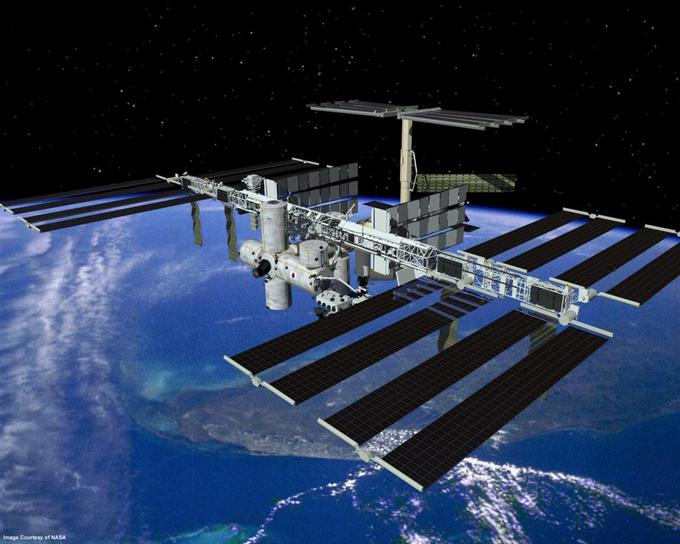
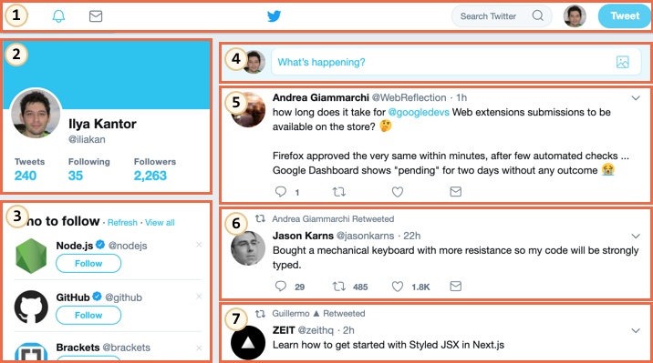

<<<<<<< HEAD
# 从星球轨道的高度讲起

这一部分我们将会讲述关于「Web Components」的一系列现代标准。

到目前为止，这些标准仍然在制定中。其中一些特性已经被很好地支持并集成到了现代 HTML/DOM 标准中，但是还有部分特性仍然处在草案阶段。你可以在任何浏览器中尝试一些例子，Google Chrome 可能是对这些新特性支持得最好的浏览器。猜测可能是因为 Google 公司的人本身就是很多相关标准的支持者。

## 共通之处在于……

整个组件化的概念并不是最新才提出的。很多框架和其他地方已经广泛地应用了组件化的设计。

在我们开始探讨实现细节之前，先让我们看看人类的伟大成就：

这是国际空间站（ISS）。

这是其组成结构（大致的）：

这个国际空间站：
- 由许多组件构成。
- 各个组件都由很多的更小的部分组成，
- 组件都非常复杂，远比大部分网站更复杂。
- 国际化的组件开发团队，整个工作由不同国家、说着不同语言的人共同完成。

……并且这个家伙能飞，它让人类在太空中能够生存！

这些复杂的设备是如何被创造的？

我们可以从中借鉴哪些原则，让我们的开发项目同样的可靠并且可大规模化呢？或者至少让我们可以接近这些目标。

## 组件化架构

众所周知，开发复杂软件的原则是：不要让软件复杂。

如果某个部分变得复杂了 —— 将其拆分成更简单的部分，再以最简明的方式组合起来。

**只有让复杂的事情简单化的架构才是好架构。**

我们可以把用户界面拆分为若干可视化组件：每个组件都在页面上占有一块位置，可以执行一个明确的任务，并且可以和其他组件区分开。

接下来看一个实际的网站的例子，比如 Twitter。

非常自然地，可以拆分为几个组件：

1. 顶部导航栏。
2. 用户信息。
3. 关注推荐。
4. 提交表格。
5. （6，7也是） —— 消息。

组件也可以包含子组件，比如消息组件可能是更高阶组件「消息列表」的子组件。可点击的用户头像可能也是一个组件，这样的例子还有很多。

我们如何划分一个组件呢？直觉、经验和常识可以帮助我们完成这件事。通常情况下，如果一个独立可视化实体，我们可以描述其可以做什么和如何在页面上交互，那么就可以将其划分为一个组件。在上面的例子中，这个页面存在几个模块，每个模块都有自己的角色，所以把它们划分为组件是合理的。

一个组件有：
- 自己的 JavaScript 类。
- DOM 结构，并且只由自己的类管理，无法被外部代码操作。（「封装」原则）。
- CSS 样式，作用在这个组件上。
- API：事件，类方法等等，让组件可以与其他组件交互。

再说一遍，整个「组件化」的概念并不是什么特别的东西。

现在已经有了很多框架和开发方法论可以实现组件化，它们各个都有自己的卖点。通常情况下，采用特殊的 CSS 类命名和一些规范，已经可以带来「组件化的感觉」 —— 即 CSS 作用域和 DOM 封装。

而现在浏览器已经原生支持了「Web Components」，我们就可以不用再自己去模拟组件化的结构了。

- [Custom elements](https://html.spec.whatwg.org/multipage/custom-elements.html#custom-elements) —— 用于自定义 HTML 元素.
- [Shadow DOM](https://dom.spec.whatwg.org/#shadow-trees) —— 为组件创造内部 DOM，它对外部是不可见的。
- [CSS Scoping](https://drafts.csswg.org/css-scoping/) —— 申明仅应用于组件的 Shadow DOM 内的样式。
- [Event retargeting](https://dom.spec.whatwg.org/#retarget) 以及更多的小东西，让自定义组件更适用于开发工作。

在下一篇中我们将会更细致地讲述「Custom Elements」 —— 一个已经被很广泛支持的 Web Components 重要组成部分。
=======
# From the orbital height

This section describes a set of modern standards for "web components".

As of now, these standards are under development. Some features are well-supported and integrated into the modern HTML/DOM standard, while others are yet in draft stage. You can try examples in any browser, Google Chrome is probably the most up to date with these features. Guess, that's because Google fellows are behind many of the related specifications.

## What's common between...

The whole component idea is nothing new. It's used in many frameworks and elsewhere.

Before we move to implementation details, take a look at this great achievement of humanity:

That's the International Space Station (ISS).

And this is how it's made inside (approximately):

The International Space Station:
- Consists of many components.
- Each component, in its turn, has many smaller details inside.
- The components are very complex, much more complicated than most websites.
- Components are developed internationally, by teams from different countries, speaking different languages.

...And this thing flies, keeps humans alive in space!

How such complex devices are created?

Which principles we could borrow to make our development same-level reliable and scalable? Or, at least, close to it.

## Component architecture

The well known rule for developing complex software is: don't make complex software.

If something becomes complex -- split it into simpler parts and connect in the most obvious way.

**A good architect is the one who can make the complex simple.**

We can split user interface into visual components: each of them has own place on the page, can "do" a well-described task, and is separate from the others.

Let's take a look at a website, for example Twitter.

It naturally splits into components:

1. Top navigation.
2. User info.
3. Follow suggestions.
4. Submit form.
5. (and also 6, 7) -- messages.

Components may have subcomponents, e.g. messages may be parts of a higher-level "message list" component. A clickable user picture itself may be a component, and so on.

How do we decide, what is a component? That comes from intuition, experience and common sense. Usually it's a separate visual entity that we can describe in terms of what it does and how it interacts with the page. In the case above, the page has blocks, each of them plays its own role, it's logical to make these components.

A component has:
- its own JavaScript class.
- DOM structure, managed solely by its class, outside code doesn't access it ("encapsulation" principle).
- CSS styles, applied to the component.
- API: events, class methods etc, to interact with other components.

Once again, the whole "component" thing is nothing special.

There exist many frameworks and development methodologies to build them, each one with its own bells and whistles. Usually, special CSS classes and conventions are used to provide "component feel" -- CSS scoping and DOM encapsulation.

"Web components" provide built-in browser capabilities for that, so we don't have to emulate them any more.

- [Custom elements](https://html.spec.whatwg.org/multipage/custom-elements.html#custom-elements) -- to define custom HTML elements.
- [Shadow DOM](https://dom.spec.whatwg.org/#shadow-trees) -- to create an internal DOM for the component, hidden from the others.
- [CSS Scoping](https://drafts.csswg.org/css-scoping/) -- to declare styles that only apply inside the Shadow DOM of the component.
- [Event retargeting](https://dom.spec.whatwg.org/#retarget) and other minor stuff to make custom components better fit the development.

In the next chapter we'll go into details of "Custom Elements" -- the fundamental and well-supported feature of web components, good on its own.
>>>>>>> 5e9eca374f644ea85c7d548bbe344fd30e5fb89d
