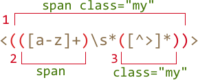

<<<<<<< HEAD
# 捕获组

正则模式的一部分可以用括号括起来 `pattern:(...)`，由此构成一个『捕获组』。

这有两个作用：

1. 当使用 [String#match](mdn:js/String/match) 或 [RegExp#exec](mdn:/RegExp/exec) 方法时，它允许你把匹配到的部分放到一个独立的数组项里面。
2. 如果我们在括号之后加上量词，那么它会应用到这个整体，而非最后一个字符。

## 例子

以下例子中的模式 `pattern:(go)+` 将会查找一个或多个 `match:'go'`：
=======
# Capturing groups

A part of a pattern can be enclosed in parentheses `pattern:(...)`. This is called a "capturing group".

That has two effects:

1. It allows to place a part of the match into a separate array.
2. If we put a quantifier after the parentheses, it applies to the parentheses as a whole, not the last character.

## Example

In the example below the pattern `pattern:(go)+` finds one or more `match:'go'`:
>>>>>>> b300836f00536a5eb9a716ad2cbb6b8fe97c25af

```js run
alert( 'Gogogo now!'.match(/(go)+/i) ); // "Gogogo"
```

<<<<<<< HEAD
如果没有括号，模式 `pattern:/go+/` 则表示 `subject:g` 之后跟上一个或多个 `subject:o`。比如：`match:goooo` 或者 `match:gooooooooo`。

捕获括号将 `pattern:(go)` 划为了一组。

让我们尝试一个更复杂的例子 —— 一个匹配 email 地址的正则表达式。

例如：
=======
Without parentheses, the pattern `pattern:/go+/` means `subject:g`, followed by `subject:o` repeated one or more times. For instance, `match:goooo` or `match:gooooooooo`.

Parentheses group the word `pattern:(go)` together.

Let's make something more complex -- a regexp to match an email.

Examples of emails:
>>>>>>> b300836f00536a5eb9a716ad2cbb6b8fe97c25af

```
my@mail.com
john.smith@site.com.uk
```

<<<<<<< HEAD
正则为：`pattern:[-.\w]+@([\w-]+\.)+[\w-]{2,20}`。

- `@` 之前的第一部分 `pattern:[-.\w]+` 可以包括单字字符、点号和中划线，比如 `match:john.smith`。
- 接着是 `pattern:@`。
- 然后是域名。可能是个二级域名 `site.com` 或者包括子域名 `host.site.com.uk`。我们可以通过『单词之后接一个点号』并且重复至少一次来匹配子域名 `match:mail.` 或者 `match:site.com.`，再然后是一个单词用来表示最后一部分 `match:.com` 或者 `match:.uk`。

    `pattern:(\w+\.)+` 用于表示单词后接一个点号（可重复）。最后一个单词不应该以点号结尾，因此它就是 `\w{2,20}`。量词 `pattern:{2,20}` 限制了长度，因为顶级域名可能为 `.uk`、`.com`、`.museum` 等等，但是其长度不能超过 20 个字符。

    因此域名部分的匹配模式为 `pattern:(\w+\.)+\w{2,20}`。现在我们可以用 `[\w-]` 替换 `\w`，因为域名也可以包含中划线`-`。由此我们得到了最终的结果。

这条正则并不完美，但是通常来说它是有效的。它很简短，并且足以让你修正错误，以及时常出现的拼写问题。

举个例子，这里我们可以找到字符串中所有的 email 地址：
=======
The pattern: `pattern:[-.\w]+@([\w-]+\.)+[\w-]{2,20}`.

1. The first part `pattern:[-.\w]+` (before `@`) may include any alphanumeric word characters, a dot and a dash, to match `match:john.smith`.
2. Then `pattern:@`, and the domain. It may be a subdomain like `host.site.com.uk`, so we match it as "a word followed by a dot `pattern:([\w-]+\.)` (repeated), and then the last part must be a word: `match:com` or `match:uk` (but not very long: 2-20 characters).

That regexp is not perfect, but good enough to fix errors or occasional mistypes.

For instance,  we can find all emails in the string:
>>>>>>> b300836f00536a5eb9a716ad2cbb6b8fe97c25af

```js run
let reg = /[-.\w]+@([\w-]+\.)+[\w-]{2,20}/g;

<<<<<<< HEAD
alert("my@mail.com @ his@site.com.uk".match(reg)); // my@mail.com,his@site.com.uk
```


## 捕获内容 

捕获括号会按从左往右的顺序标上序号。查找引擎会记住每个括号内的内容，并且允许你在模式以及替换字符串中引用它。

举例来说，我们可以使用一个（简化版）的模式 `pattern:<.*?>` 来查找一个 HTML 标签。一般来说，我们会希望对这个结果做些什么。

如果我们把 `<...>` 里面的内容放到一对捕获括号里，那么我们通过这种方法来引用它：
=======
alert("my@mail.com @ his@site.com.uk".match(reg)); // my@mail.com, his@site.com.uk
```

In this example parentheses were used to make a group for repeating `pattern:(...)+`. But there are other uses too, let's see them.

## Contents of parentheses  

Parentheses are numbered from left to right. The search engine remembers the content matched by each of them and allows to reference it in the pattern or in the replacement string.

For instance, we'd like to find HTML tags `pattern:<.*?>`, and process them.

Let's wrap the inner content into parentheses, like this: `pattern:<(.*?)>`.

We'll get both the tag as a whole and its content as an array:
>>>>>>> b300836f00536a5eb9a716ad2cbb6b8fe97c25af

```js run
let str = '<h1>Hello, world!</h1>';
let reg = /<(.*?)>/;

alert( str.match(reg) ); // Array: ["<h1>", "h1"]
```
<<<<<<< HEAD
[String#match](mdn:js/String/match) 只有在正则表达式中没有 `pattern:/.../g` 标记时才会返回组。

如果我们需要查找所有的匹配组，那么我们可以使用在 <info:regexp-methods> 中介绍过的 [RegExp#exec](mdn:js/RegExp/exec) 方法：
=======

The call to [String#match](mdn:js/String/match) returns groups only if the regexp only looks for the first match, that is: has no `pattern:/.../g` flag.

If we need all matches with their groups then we can use `.matchAll` or `regexp.exec` as described in <info:regexp-methods>:
>>>>>>> b300836f00536a5eb9a716ad2cbb6b8fe97c25af

```js run
let str = '<h1>Hello, world!</h1>';

<<<<<<< HEAD
// 两组匹配：起始标签 <h1>和闭合标签</h1>
let reg = /<(.*?)>/g;

let match;

while (match = reg.exec(str)) {
  // 第一次显示匹配：<h1>,h1
  // 之后显示匹配：</h1>,/h1
  alert(match);
}
```

如此我们便得到了 `pattern:<(.*?)>` 的两个匹配项，他们中的每一个都包括完整的匹配和对应的捕获组。

## 嵌套捕获组

捕获括号是可以嵌套的。在这种情况下，依然是从左往右编号。

举个例子，当对标签 `subject:<span class="my">` 进行查找时，我们可能感兴趣的有：

1. 标签整体的内容：`match:span class="my"`。
2. 标签名：`match:span`。
3. 标签的属性：`match:class="my"`。

让我们为它们加上捕获括号：
=======
// two matches: opening <h1> and closing </h1> tags
let reg = /<(.*?)>/g;

let matches = Array.from( str.matchAll(reg) );

alert(matches[0]); //  Array: ["<h1>", "h1"]
alert(matches[1]); //  Array: ["</h1>", "/h1"]
```

Here we have two matches for `pattern:<(.*?)>`, each of them is an array with the full match and groups.

## Nested groups

Parentheses can be nested. In this case the numbering also goes from left to right.

For instance, when searching a tag in `subject:<span class="my">` we may be interested in:

1. The tag content as a whole: `match:span class="my"`.
2. The tag name: `match:span`.
3. The tag attributes: `match:class="my"`.

Let's add parentheses for them:
>>>>>>> b300836f00536a5eb9a716ad2cbb6b8fe97c25af

```js run
let str = '<span class="my">';

let reg = /<(([a-z]+)\s*([^>]*))>/;

let result = str.match(reg);
alert(result); // <span class="my">, span class="my", span, class="my"
```

<<<<<<< HEAD
它看起来像这样：



`result` 的首项永远是完整的匹配结果。

之后就是各个捕获组，从左往右依次排开。第一个左括号将会匹配到第一个捕获组 `result[1]`。在这个例子中，它涵盖了整个标签的内容。

`result[2]` 对应第二个左括号 `pattern:(` 到与其对应的右括号 `pattern:)` 之间的内容 —— 标签名。再然后，我们跳过空格，将所有属性划为一组，对应 `result[3]`。

**如果某个捕获组是可选的，且在匹配中没有找到对应项，那么在相应的匹配结果中，该项依然会存在（值为 `undefined`）。**

让我们考虑这条正则表达式 `pattern:a(z)?(c)?`。它会查找字符 `"a"`，之后可能跟着一个 `"z"`，之后可能跟着一个 `"c"`。

如果我们对单个字符 `subject:a` 执行匹配，其结果为：
=======
Here's how groups look:


At the zero index of the `result` is always the full match.

Then groups, numbered from left to right. Whichever opens first gives the first group `result[1]`. Here it encloses the whole tag content.

Then in `result[2]` goes the group from the second opening `pattern:(` till the corresponding `pattern:)` -- tag name, then we don't group spaces, but group attributes for `result[3]`.

**If a group is optional and doesn't exist in the match, the corresponding `result` index is present (and equals `undefined`).**

For instance, let's consider the regexp `pattern:a(z)?(c)?`. It looks for `"a"` optionally followed by `"z"` optionally followed by `"c"`.

If we run it on the string with a single letter `subject:a`, then the result is:
>>>>>>> b300836f00536a5eb9a716ad2cbb6b8fe97c25af

```js run
let match = 'a'.match(/a(z)?(c)?/);

alert( match.length ); // 3
alert( match[0] ); // a (whole match)
alert( match[1] ); // undefined
alert( match[2] ); // undefined
```

<<<<<<< HEAD
该数组包含三项，但是所有的捕获组都为空。

对于 `subject:ack`，情况要更复杂一些：
=======
The array has the length of `3`, but all groups are empty.

And here's a more complex match for the string `subject:ack`:
>>>>>>> b300836f00536a5eb9a716ad2cbb6b8fe97c25af

```js run
let match = 'ack'.match(/a(z)?(c)?/)

alert( match.length ); // 3
alert( match[0] ); // ac (whole match)
<<<<<<< HEAD
alert( match[1] ); // undefined，因为 (z)? 没有匹配项
alert( match[2] ); // c
```

数组的长度依然是 `3`。但是因为捕获组 `pattern:(z)?` 没有对应项，所以结果为 `["ac", undefined, "c"]`。

## 非捕获组 ?:

某些时候，我们会希望使用括号来正确设置量词，但是并不希望其内容出现在结果数组中。

你可以通过在开头加上 `pattern:?:` 从而在结果中排除该组。

例如，我们希望找到 `pattern:(go)+`，但是并不希望其内容（`go`）出现在单独的数组项中，那么我们可以这样写：`pattern:(?:go)+`。

下面的例子中，只有名字『John』会作为一个独立项出现在 `results` 数组里：
=======
alert( match[1] ); // undefined, because there's nothing for (z)?
alert( match[2] ); // c
```

The array length is permanent: `3`. But there's nothing for the group `pattern:(z)?`, so the result is `["ac", undefined, "c"]`.

## Named groups

Remembering groups by their numbers is hard. For simple patterns it's doable, but for more complex ones we can give names to parentheses.

That's done by putting `pattern:?<name>` immediately after the opening paren, like this:

```js run
*!*
let dateRegexp = /(?<year>[0-9]{4})-(?<month>[0-9]{2})-(?<day>[0-9]{2})/;
*/!*
let str = "2019-04-30";

let groups = str.match(dateRegexp).groups;

alert(groups.year); // 2019
alert(groups.month); // 04
alert(groups.day); // 30
```

As you can see, the groups reside in the `.groups` property of the match.

We can also use them in the replacement string, as `pattern:$<name>` (like `$1..9`, but a name instead of a digit).

For instance, let's reformat the date into `day.month.year`:

```js run
let dateRegexp = /(?<year>[0-9]{4})-(?<month>[0-9]{2})-(?<day>[0-9]{2})/;

let str = "2019-04-30";

let rearranged = str.replace(dateRegexp, '$<day>.$<month>.$<year>');

alert(rearranged); // 30.04.2019
```

If we use a function for the replacement, then named `groups` object is always the last argument:

```js run
let dateRegexp = /(?<year>[0-9]{4})-(?<month>[0-9]{2})-(?<day>[0-9]{2})/;

let str = "2019-04-30";

let rearranged = str.replace(dateRegexp,
  (str, year, month, day, offset, input, groups) =>
   `${groups.day}.${groups.month}.${groups.year}`
);

alert(rearranged); // 30.04.2019
```

Usually, when we intend to use named groups, we don't need positional arguments of the function. For the majority of real-life cases we only need `str` and `groups`.

So we can write it a little bit shorter:

```js
let rearranged = str.replace(dateRegexp, (str, ...args) => {
  let {year, month, day} = args.pop();
  alert(str); // 2019-04-30
  alert(year); // 2019
  alert(month); // 04
  alert(day); // 30
});
```


## Non-capturing groups with ?:

Sometimes we need parentheses to correctly apply a quantifier, but we don't want the contents in results.

A group may be excluded by adding `pattern:?:` in the beginning.

For instance, if we want to find `pattern:(go)+`, but don't want to remember the contents (`go`) in a separate array item, we can write: `pattern:(?:go)+`.

In the example below we only get the name "John" as a separate member of the `results` array:
>>>>>>> b300836f00536a5eb9a716ad2cbb6b8fe97c25af

```js run
let str = "Gogo John!";
*!*
<<<<<<< HEAD
// 避免捕获 Gogo
=======
// exclude Gogo from capturing
>>>>>>> b300836f00536a5eb9a716ad2cbb6b8fe97c25af
let reg = /(?:go)+ (\w+)/i;
*/!*

let result = str.match(reg);

alert( result.length ); // 2
alert( result[1] ); // John
```
<<<<<<< HEAD
=======

## Summary

Parentheses group together a part of the regular expression, so that the quantifier applies to it as a whole.

Parentheses groups are numbered left-to-right, and can optionally be named with  `(?<name>...)`.

The content, matched by a group, can be referenced both in the replacement string as `$1`, `$2` etc, or by the name `$name` if named.

So, parentheses groups are called "capturing groups", as they "capture" a part of the match. We get that part separately from the result as a member of the array or in `.groups` if it's named.

We can exclude the group from remembering (make in "non-capturing") by putting `?:` at the start: `(?:...)`, that's used if we'd like to apply a quantifier to the whole group, but don't need it in the result.
>>>>>>> b300836f00536a5eb9a716ad2cbb6b8fe97c25af
