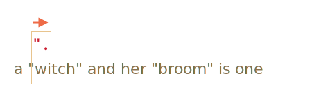
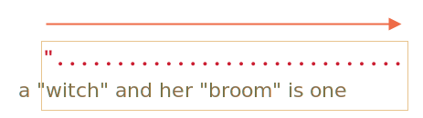
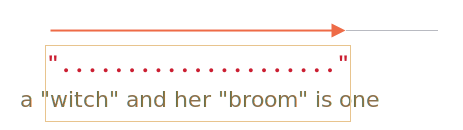

# 贪婪量词和惰性量词

量词乍一看非常简单，但实际上它们可能很棘手。

如果我们打算寻找比 `pattern:/\d+/` 更复杂的东西，就需要理解搜索的工作原理。

以接下来的任务为例。

有一个文本，我们需要用书名号：`«...»` 来代替所有的引号 `"..."`。在许多国家，书名号是排版的首选。

例如：`"Hello, world"` 应该变成 `«Hello, world»`。还有其他引用，例如 `„Witam, świat!”`（波兰语）或 `「你好，世界」`（中文），但对于我们的任务，让我们选择 `«...»` 吧。

首先要做的是定位带引号的字符串，然后替换它们。

像 `pattern:/".+"/g`（一个引号，然后是一些内容，然后是另一个引号）这样的正则表达式看起来可能很合适，但事实并非如此！

让我们试一下：

```js run
let regexp = /".+"/g;

let str = 'a "witch" and her "broom" is one';

alert( str.match(regexp) ); // "witch" and her "broom"
```

……可以看出来它的运行结果与预期不同！

它没有找到匹配项 `match:"witch"` 和 `match:"broom"`，而是找到：`match:"witch" and her "broom"`。

这可被称为“贪婪是万恶之源”。

## 贪婪搜索

为了查找到一个匹配项，正则表达式引擎采用了以下算法：

- 对于字符串中的每一个位置
    - 尝试匹配该位置的模式。
    - 如果未匹配，则转到下一个位置。

这样简单的描述并不能说清楚这个正则表达式匹配失败的原因，所以让我们详细说明一下模式 `pattern:".+"` 是如何进行搜索的。

1. 该模式的第一个字符是一个引号 `pattern:"`。

    正则表达式引擎尝试在源字符串 `subject:a "witch" and her "broom" is one` 的位置 0 找到它，但那里有 `subject:a`，所以匹配失败。

    然后继续前进：移至源字符串中的下一个位置，并尝试匹配模式中的第一个字符，再次失败，最终在第三个位置匹配到了引号：

    

2. 找到引号后，引擎就尝试去匹配模式中的剩余字符。它尝试查看剩余的字符串是否符合 `pattern:.+"`。

    在我们的用例中，模式中的下一个字符为 `pattern:.`（一个点）。它表示匹配除了换行符之外的任意字符，所以将会匹配下一个字符 `match:'w'`：

    

3. 然后由于量词 `pattern:.+`，点会重复。正则表达式引擎一个接一个字符地进行匹配。

    ……什么时候会不匹配？点（.）能够匹配所有字符，所以只有在移至字符串末尾时才停止匹配：

    

4. 现在引擎完成了对重复模式 `pattern:.+` 的搜索，并且试图寻找模式中的下一个字符。是引号 `pattern:"`。但是有一个问题：对字符串的遍历已经结束，没有更多字符了！

    正则表达式引擎知道它为 `pattern:.+` 匹配太多项了，所以开始 **回溯**。

    换句话说，它去掉了量词匹配项的最后一个字符：

    

    现在它假设 `pattern:.+` 的匹配在字符串的倒数第一个字符前的位置结束，并尝试从该位置匹配模式的剩余部分。

    如果那里有引号，则搜索将结束，但最后一个字符是 `subject:'e'`，所以不匹配。 

5. ……所以引擎会将 `pattern:.+` 的重复次数减少一个字符：

    

    引号 `pattern:'"'` 与 `subject:'n'` 不匹配。

6. 引擎不断进行回溯：它减少 `pattern:'.'` 的重复次数，直到模式的其余部分（在我们的用例中是 `pattern:'"'`）匹配到结果：

    

7. 匹配完成。

8. 所以，第一次匹配项是 `match:"witch" and her "broom"`。如果正则表达式具有修饰符 `pattern:g`，则搜索将从第一个匹配结束的地方继续。字符串 `subject:is one` 的剩余部分不再有引号，因此没有更多匹配项。

这可能不是我们所期望的，但这就是它的工作方式。

**在贪婪模式下（默认情况），量词都会尽可能多地重复。**

正则表达式引擎尝试用 `pattern:.+` 去匹配尽可能多的字符，然后在模式的其余部分不匹配时再将其逐一缩短。

对于这个任务，我们想要得是另一种结果。这也就是惰性量词模式的用途。

## 惰性模式

惰性模式中的量词与贪婪模式中的是相反的。它表示：“重复最少的次数”。

我们可以通过在量词后面添加一个问号 `pattern:'?'` 来启用它，这样匹配模式就变成了 `pattern:*?` 或 `pattern:+?`，甚至将 `pattern:'?'` 变成 `pattern:??`。

这么说吧：通常问号 `pattern:?` 本身就是一个量词（0 或 1），但如果将其放到 **另一个量词（甚至是它自己）后面**，就会有不同的含义 —— 它将匹配的模式从贪婪转为惰性。

正则表达式 `pattern:/".+?"/g` 能够按预期工作了：它找到了 `match:"witch"` 和 `match:"broom"`：

```js run
let regexp = /".+?"/g;

let str = 'a "witch" and her "broom" is one';

alert( str.match(regexp) ); // "witch", "broom"
```

为了更清楚地理解这个变化，我们来一步步解析这个搜索过程。

1. 第一步是一样的：它在第三个字符的位置找到了模式的开头 `pattern:'"'`：

    

2. 下一步也是类似的：引擎为 `pattern:'.'` 找到了一个匹配项：

    

3. 接下来的搜索就有些不同了。因为我们对 `pattern:+?` 启用了惰性模式，引擎不会去尝试多匹配一个点的匹配字符，而会停止并立即尝试对剩余的模式 `pattern:'"'` 进行匹配：

    

    如果这里有一个引号，搜索就会停止，但这里是一个 `'i'`，所以没有匹配到引号。
4. 接着，正则表达式引擎增加对点的重复搜索次数，并且再次尝试：

    

    又失败了。然后重复次数一次又一次的增加……
5. ……直到找到了模式中的剩余部分的匹配项：

    

6. 接下来的搜索从当前匹配的结尾开始，并产生了下一个匹配项：

    

在这个例子中，我们看到了惰性模式的 `pattern:+?` 是怎样工作的。量词 `pattern:*?` 和 `pattern:??` 的工作方式类似 —— 正则表达式引擎仅在模式的其余部分无法在给定位置匹配时增加重复次数。

**惰性模式仅对带有 `?` 的量词启用**

其它量词依旧保持贪婪模式。

例如：

```js run
alert( "123 456".match(/\d+ \d+?/) ); // 123 4
```

1. 模式 `pattern:\d+` 尝试匹配尽可能多的数字（贪婪模式），因此在它找到 `match:123` 时停止，因为下一个字符为空格 `pattern:' '`。
2. 然后模式中有一个空格，正好匹配。
3. 然后是 `pattern:\d+?`。此量词处于惰性模式，所以它匹配一个数字 `match:4` 后开始尝试去检查模式的剩余部分是否匹配。

    ……但是在 `pattern:\d+?` 之后没有其它内容了。

    惰性模式在不必要的情况下不会重复任何东西。模式结束，我们找到了匹配项 `match:123 4`。

```smart header="优化"
现在正则表达式引擎会通过优化内部算法来提升效率。所以它们的工作方式和所描述的算法可能略有不同。

但如果只是为了了解正则表达式的工作原理和如何构建正则表达式我们不需要知道这些。它们仅用于内部算法优化。

复杂的正则表达式是很难优化的，因此搜索的过程也可以完全按照描述的方式进行。
```

## 替代方法

使用正则表达式，通常有不止一种方式可以做相同的事。

在我们的例子中，我们可以在不启用惰性模式的情况下使用正则表达式 `pattern:"[^"]+"` 找到带引号的字符串：

```js run
let regexp = /"[^"]+"/g;

let str = 'a "witch" and her "broom" is one';

alert( str.match(regexp) ); // "witch", "broom"
```

正则表达式 `pattern:"[^"]+"` 给出了正确答案，因为它查找一个引号 `pattern:'"'` 后跟一个或更多非引号 `pattern:[^"]` 的字符，然后是结束的引号。

当引擎寻找 `pattern:[^"]+` 时，它会在匹配到结束的引号时停止重复，这样就完成了。

请注意，这个逻辑并不能取代惰性量词！

它们是不同的。我们在不同情况下可能会需要使用到其中的一个或另一个。

**让我们再来看一个使用惰性量词失败而使用这种变体能获得预期结果的例子。**

例如，我们想要找到 `<a href="..." class="doc">` 形式的带有任意 `href` 的链接。

该使用哪个正则表达式呢？

首先可能会想到：`pattern:/<a href=".*" class="doc">/g`。

验证一下：
```js run
let str = '...<a href="link" class="doc">...';
let regexp = /<a href=".*" class="doc">/g;

// 有效！
alert( str.match(regexp) ); // <a href="link" class="doc">
```

……但如果文本中有多个链接呢？

```js run
let str = '...<a href="link1" class="doc">... <a href="link2" class="doc">...';
let regexp = /<a href=".*" class="doc">/g;

// 蛤！一个匹配项中有两个链接！
alert( str.match(regexp) ); // <a href="link1" class="doc">... <a href="link2" class="doc">
```

现在这个结果是错的，原因与我们的 "witches" 示例相同。量词 `pattern:.*` 占用了太多字符。

匹配结果如下：

```html
<a href="....................................." class="doc">
<a href="link1" class="doc">... <a href="link2" class="doc">
```

让我们启用惰性量词 `pattern:.*?` 来修改模式：

```js run
let str = '...<a href="link1" class="doc">... <a href="link2" class="doc">...';
let regexp = /<a href=".*?" class="doc">/g;

// 正确了！
alert( str.match(regexp) ); // <a href="link1" class="doc">, <a href="link2" class="doc">
```

现在能成功了，有两个匹配项：

```html
<a href="....." class="doc">    <a href="....." class="doc">
<a href="link1" class="doc">... <a href="link2" class="doc">
```

……但是让我们用另外一个文本来测试看看：

```js run
let str = '...<a href="link1" class="wrong">... <p style="" class="doc">...';
let regexp = /<a href=".*?" class="doc">/g;

// 错误的匹配！
alert( str.match(regexp) ); // <a href="link1" class="wrong">... <p style="" class="doc">
```

现在它匹配错了。匹配项不仅包括了一个链接，还包括了它后面的很多文本，包括 `<p...>`。

为什么？

原因如下：

1. 首先，正则表达式寻找链接的开始：`match:<a href="`。
2. 然后它寻找 `pattern:.*?`，取一个字符（惰性的！），然后检查字符串的剩余部分是否与模式的剩余部分匹配（未匹配）。
3. 然后再取一个字符到 `pattern:.*?` 中，以此类推……直到最终到达 `match:" class="doc">`。

但问题是：这已经超出了链接 `<a...>`，已经在另一个标签 `<p>` 中了。这不是我们想要的。

这是与匹配项在文本上对齐的示例：

```html
<a href="..................................." class="doc">
<a href="link1" class="wrong">... <p style="" class="doc">
```

所以，我们需要模式寻找 `<a href="...something..." class="doc">`，但贪婪模式和惰性模式都有问题。

正确的变体可以是这样的：`pattern:href="[^"]*"`。它会获取 `href` 特性中的所有字符直到最近的引号，正好符合我们的需求。

举个例子：

```js run
let str1 = '...<a href="link1" class="wrong">... <p style="" class="doc">...';
let str2 = '...<a href="link1" class="doc">... <a href="link2" class="doc">...';
let regexp = /<a href="[^"]*" class="doc">/g;

// 有效！
alert( str1.match(regexp) ); // null，无匹配项，这是对的
alert( str2.match(regexp) ); // <a href="link1" class="doc">, <a href="link2" class="doc">
```

## 总结

量词有两种工作模式：

贪婪模式
: 默认情况下，正则表达式引擎会尝试尽可能多地重复量词字符。例如，`pattern:\d+` 会消耗所有可能的字符。当无法消耗更多（在尾端没有更多的数字或字符串）时，然后它再匹配模式的剩余部分。如果没有匹配，则减少重复的次数（回溯），并再次尝试。

惰性模式
: 通过在量词后添加问号 `pattern:?` 来启用。正则表达式引擎尝试在每次重复量化字符之前匹配模式的其余部分。

正如我们所见，惰性模式并不是贪婪搜索的“灵丹妙药”。另一种方式是使用排除项“微调”贪婪搜索，如模式 `pattern:"[^"]+"`。
