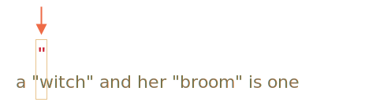

# 贪婪量词和惰性量词

量词，看上去十分简单，但实际上它可能会很棘手。

如果我们打算寻找比 `pattern:/\d+/` 更加复杂的东西，就需要理解搜索工作是如何进行的。

以接下来的问题为例。

有一个文本，我们需要用书名号：`«...»` 来代替所有的引号 `"..."`。在许多国家，它们是排版的首选。

例如：`"Hello, world"` 将会变成 `«Hello, world»`。

一些国家偏爱 `„Witam, świat!”`（波兰语）甚至 `「你好，世界」`（汉语）引号。对于不同的语言环境，我们可以选择不同的替代方式，但它们都是一样的，那我们就以书名号 `«...»` 开始。

为了进行替换，我们首先要找出所有被引号围起来的子串。

正则表达式看上去可能是这样的：`pattern:/".+"/g`。这个表达式的意思是：我们要查找这样一个句子，一个引号后跟一个或多个字符，然后以另一个引号结尾。

...但如果我们试着在一个如此简单的例子中去应用它...

```js run
let reg = /".+"/g;

let str = 'a "witch" and her "broom" is one';

alert( str.match(reg) ); // "witch" and her "broom"
```

...我们会发现它的运行结果与预期不同！

它直接找到了一个匹配结果：`match:"witch" and her "broom"`，而不是找到两个匹配结果 `match:"witch"` 和 `match:"broom"`。

这可被称为“贪婪是万恶之源”。

## 贪婪搜索

为了查找到一个匹配项，正则表达式引擎采用了以下算法：

- 对于字符串中的每一个字符
    - 用这个模式来匹配此字符。
    - 若无匹配，移至下一个字符

这些简单的词语没有说清楚为什么这个正则表达式匹配失败了，因此，让我们详细说明一下模式 `pattern:".+"` 是如何进行搜索工作的。

1. 该模式的第一个字符是一个引号 `pattern:"`。

    正则表达式引擎企图在字符串 `subject:a "witch" and her "broom" is one` 的第一个位置就匹配到目标，但这个位置是 subject:a，所以匹配失败。

    然后它进行下一步：移至字符串中的下一个位置，并试图匹配模式中的第一个字符，最终在第三个位置匹配到了引号：

    

2. 检测到了引号后，引擎就尝试去匹配模式中的剩余字符。它试图查看剩余的字符串主体是否符合 `pattern:.+"`。

    在我们的用例中，模式中的下一个字符为 `pattern:.`（一个点）。它表示匹配除了换行符之外的任意字符，所以将会匹配下一个字符 `match:'w'`：

    

3. 然后因为量词 `pattern:.+`，模式中的点（.）将会重复。正则表达式引擎逐一读取字符，当该字符可能匹配时就用它来构建匹配项。

    ...什么时候会不匹配？点（.）能够匹配所有字符，所以只有在移至字符串末尾时才停止匹配：

    

4. 现在引擎完成了对重复模式 `pattern:.+` 的搜索，并且试图寻找模式中的下一个字符。这个字符是引号 `pattern:"`。但还有一个问题，对字符串的遍历已经结束，已经没有更多的字符了！

    正则表达式引擎明白它已经为 `pattern:.+` 匹配了太多项了，所以开始**回溯**了。

    换句话说，它去掉了量词的匹配项的最后一个字符：

    

    现在它假设在结束前，`pattern:.+` 会匹配一个字符，并尝试匹配剩余的字符。

    如果出现了一个引号，就表示到达了末尾，但最后一个字符是 `subject:'e'`，所以无法匹配。 

5. ...所以引擎会再去掉一个字符，以此来减少 `pattern:.+` 的重复次数：

    

    `pattern:'"'` 并不会匹配 `subject:'n'`。

6. 引擎不断进行回溯：它减少了 `pattern:'.'` 的重复次数，直到模式的其它部分（在我们的用例中是 `pattern:'"'`）匹配到结果：

    

7. 匹配完成。

8. 所以，第一次匹配是 `match:"witch" and her "broom"`。接下来的搜索的起点位于第一次搜索的终点，但在 `subject:is one` 中没有更多的引号了，所以没有其它的结果了。

这可能不是我们所想要的，但这就是它的工作原理。

**在贪婪模式下（默认情况下），量词都会尽可能地重复多次。**

正则表达式引擎尝试用 `pattern:.+` 去获取尽可能多的字符，然后再一步步地筛选它们。

对于这个问题，我们想要另一种结果，这也就是懒惰量词模式的用途。

## 懒惰模式

懒惰模式中的量词与贪婪模式中的是相反的。它想要“重复最少次数”。

我们能够通过在量词之后添加一个问号 `pattern:'?'` 来启用它，所以匹配模式变为 `pattern:*?` 或 `pattern:+?`，甚至将 `pattern:'?'` 变为 `pattern:??`。

这么说吧：通常，一个问号 `pattern:?` 就是一个它本身的量词（0 或 1），但如果添加**另一个量词（甚至可以是它自己）**，就会有不同的意思 —— 它将匹配的模式从贪婪转为懒惰。

正则表达式 `pattern:/".+?"/g` 正如预期工作：它找到了 `match:"witch"` 和 `match:"broom"`：

```js run
let reg = /".+?"/g;

let str = 'a "witch" and her "broom" is one';

alert( str.match(reg) ); // witch, broom
```

为了更清楚地理解这个变化，我们来一步步解析这个搜索过程。

1. 第一步依然相同：它在第三个位置开始 `pattern:'"'`：

    

2. 下一步也是类似的：引擎为 `pattern:'.'` 找到了一个匹配项：

    

3. 接下来就是搜索过程出现不同的时候了。因为我们对 `pattern:+?` 启用了懒惰模式，引擎不会去尝试多匹配一个点，并且开始了对剩余的 `pattern:'"'` 的匹配：

    

    如果有一个引号，搜索就会停止，但是有一个 `'i'`，所以没有匹配到引号。
4. 接着，正则表达式引擎增加对点的重复搜索次数，并且再次尝试：

    

    又失败了。然后重复次数一次又一次的增加...
5. ...直到模式中的剩余部分找到匹配项：

    

6. 接下来的搜索工作从当前匹配结束的那一项开始，就会再产生一个结果：

    

在这个例子中，我们看到了懒惰模式 `pattern:+?` 是怎样工作的。量词 `pattern:*?` 和 `pattern:??` 也有类似的效果 —— 只有在模式的剩余部分无法在给定位置匹配时，正则表达式引擎才会增加重复次数。

**懒惰模式只能够通过带 `?` 的量词启用**

其它的量词依旧保持贪婪模式。

例如：

```js run
alert( "123 456".match(/\d+ \d+?/g) ); // 123 4
```

1. 模式 `pattern:\d+` 尝试匹配尽可能多的数字（贪婪模式），因此在它找到 `match:123` 时停止，因为下一个字符为空格 `pattern:' '`。
2. 匹配到一个空格。
3. 由于 `pattern:\d+?`。量词是出于懒惰模式的，所以它匹配一个数字 `match:4` 并且尝试去检测模式的剩余部分是否匹配。

    。。。但是在 `pattern:\d+?` 之后没有其它的匹配项了。

    懒惰模式不会在不必要的情况下重复任何事情。模式结束，所以我们找到了匹配项 `match:123 4`。
4. 接下来的搜索工作从字符 `5` 开始。

```smart header="Optimizations"
当代的正则表达式引擎会通过优化内部算法来提升效率。所以它们的工作流程和所描述的算法可能略有不同。

但如果只是为了理解正则表达式是如何工作以及如何构建的，我们不需要知道这些，它们仅用于内部优化。

复杂的正则表达式是难以优化的，所以搜索的过程可能会完全按照描述进行。
```

## 替代方法

在正则表达式中，通常有多种方法来达到某个相同目的。

在用例中，我们能够在不启用懒惰模式的情况下用 `pattern:"[^"]+"` 找到带引号的字符串：

```js run
let reg = /"[^"]+"/g;

let str = 'a "witch" and her "broom" is one';

alert( str.match(reg) ); // witch, broom
```

`pattern:"[^"]+"` 得到了正确的答案，因为它查找一个引号 `pattern:'"'`，后跟一个或多个非引号字符  `pattern:[^"]`，然后是结束的引号。

当引擎寻找 `pattern:[^"]+` 时，它会在匹配到结束的引号时停止重复，这样就完成了。

请注意，这个逻辑并不能取代惰性量词！

这是不同的，我们有时需要这一个，有时却需要另一个。

让我们再来看一个使用惰性量词失败而使用这种方式正确的例子。

例如，我们想要找到 `<a href="..." class="doc">` 形式的链接，或是任意 `href`。

该使用哪个正则表达式呢？

首先可能会想到：`pattern:/<a href=".*" class="doc">/g`。

验证一下：
```js run
let str = '...<a href="link" class="doc">...';
let reg = /<a href=".*" class="doc">/g;

// Works!
alert( str.match(reg) ); // <a href="link" class="doc">
```

...但如果文本中有多个链接呢？

```js run
let str = '...<a href="link1" class="doc">... <a href="link2" class="doc">...';
let reg = /<a href=".*" class="doc">/g;

// Whoops! Two links in one match!
alert( str.match(reg) ); // <a href="link1" class="doc">... <a href="link2" class="doc">
```

现在这个结果和我们的 "witches" 用例结果的错误原因是一样的。量词 `pattern:.*` 占用太多字符了。

匹配结果如下：

```html
<a href="....................................." class="doc">
<a href="link1" class="doc">... <a href="link2" class="doc">
```

让我们启用惰性量词 `pattern:.*?` 来修改模式：

```js run
let str = '...<a href="link1" class="doc">... <a href="link2" class="doc">...';
let reg = /<a href=".*?" class="doc">/g;

// 有效！
alert( str.match(reg) ); // <a href="link1" class="doc">, <a href="link2" class="doc">
```

现在能成功了，有两个匹配项：

```html
<a href="....." class="doc">    <a href="....." class="doc">
<a href="link1" class="doc">... <a href="link2" class="doc">
```

它的工作原理是 —— 在上述的解释之后，这应该是显而易见的。所以我们不停留在这些细节上，来再尝试一个例子：

```js run
let str = '...<a href="link1" class="wrong">... <p style="" class="doc">...';
let reg = /<a href=".*?" class="doc">/g;

// 错误！
alert( str.match(reg) ); // <a href="link1" class="wrong">... <p style="" class="doc">
```

我们会发现，这个正则表达式不仅匹配了一个链接，还匹配了包含 `<p...>` 的一段文本。

为什么？

1. 首先，正则表达式发现一个链接标签：`match:<a href="`。

2. 然后它寻找 `pattern:.*?`，我们取一个字符，检查其是否与模式的剩余部分匹配，然后再取另一个。。。

    量词 `pattern:.*?` 检测字符，直到 `match:class="doc">`。

    ...在哪里可以找到它呢？我们如果查看文本，就可以看到唯一的 `match:class="doc">` 是在链接之后的，在 `<p>` 中。

3. 所以有了如下匹配项：

    ```html
    <a href="..................................." class="doc">
    <a href="link1" class="wrong">... <p style="" class="doc">
    ```

所以，懒惰模式在这里不起作用。

我们需要寻找 `<a href="...something..." class="doc">`，但贪婪和懒惰模式都有一些问题。

正确的做法应该是这样的：`pattern:href="[^"]*"`。它会获取 href 属性中的所有字符，正好符合我们的需求。

一个实例：

```js run
let str1 = '...<a href="link1" class="wrong">... <p style="" class="doc">...';
let str2 = '...<a href="link1" class="doc">... <a href="link2" class="doc">...';
let reg = /<a href="[^"]*" class="doc">/g;

// Works!
alert( str1.match(reg) ); // 没有匹配项，是正确的
alert( str2.match(reg) ); // <a href="link1" class="doc">, <a href="link2" class="doc">
```

## 总结

量词有两种工作模式：

贪婪模式
: 默认情况下，正则表达式引擎会尝试尽可能多地重复量词。例如，`pattern:\d+` 检测所有可能的字符。当不可能检测更多（没有更多的字符或到达字符串末尾）时，然后它再匹配模式的剩余部分。如果没有匹配，则减少重复的次数（回溯），并再次尝试。

懒惰模式
: 通过在量词后添加问号 `pattern:?` 来启用。在每次重复量词之前，引擎会尝试去匹配模式的剩余部分。

正如我们所见，懒惰模式并不是针对贪婪搜索的灵丹妙药。另一种方式是“微调”贪婪搜索，我们很快就会见到更多的例子。
